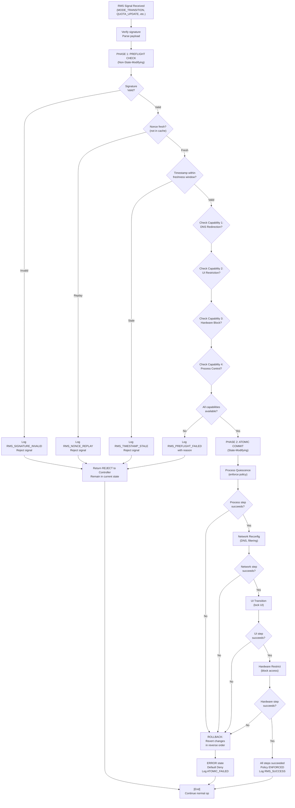
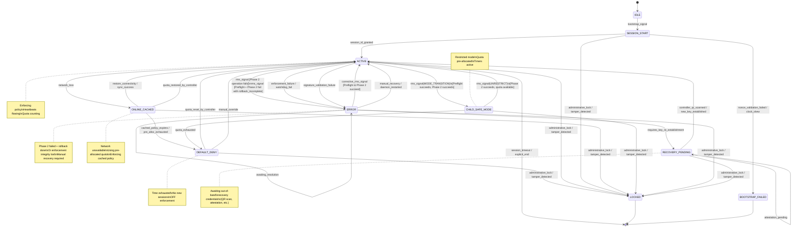

---
title: "Cross-Platform Policy Parental Control (X-PPC) for Household Governance"
abbrev: "X-PPC"
category: info
ipr: trust200902

docname: draft-oprea-x-ppc-latest
submissiontype: IETF
date: 2026-02-27
consensus: false
v: 3
area: "General"
keyword:
 - policy control
 - household governance
 - trusted computing
 - remote attestation

author:
 -
    fullname: David Emanuel Oprea
    organization: ONE NEW EXPERIENCE
    email: david.emy@gmail.com

normative:
  RFC8785:
  RFC8610:
  RFC8259:
  RFC8032:
  RFC5905:
  RFC8446:
  RFC3339:
  RFC4648:
  RFC5234:
  RFC8141:
  RFC9110:
  RFC9562:

informative:
  RFC8949:
  W3C.RDF:
    target: https://www.w3.org/RDF/
    title: "Resource Description Framework (RDF)"
    date: 2004-02
  FIPS186-5:
    target: https://nvlpubs.nist.gov/nistpubs/FIPS/NIST.FIPS.186-5.pdf
    title: "Digital Signature Standard (DSS)"
    author:
      - org: National Institute of Standards and Technology
    date: 2023-08
    seriesInfo:
      name: FIPS
      value: 186-5
  TPM2:
    target: https://trustedcomputinggroup.org/resource/tpm-2-0-library-specification/
    title: "Trusted Platform Module 2.0 Library - Part 1: Architecture Specification"
    author:
      - org: Trusted Computing Group
    date: 2019-06

...

--- abstract

This document defines the Cross-Platform Policy Parental Control (X-PPC) protocol for consistent policy enforcement across heterogeneous household endpoints including Desktop PCs, Mobile Devices, Gaming Consoles, Handhelds, and Smart TVs. X-PPC 1.0.0 specifies a 3-tier hybrid trust-chain architecture designed to enable policy enforcement during periods of network unavailability. The protocol defines interoperable message formats, signature requirements, and enforcement semantics that OS and device vendors can implement using platform-appropriate mechanisms.


--- middle

# Introduction

Household networks comprise heterogeneous devices including personal computers, mobile phones, gaming consoles, streaming devices, and smart televisions. Managing consistent security policies across these disparate platforms and operating systems remains a challenge due to device-specific enforcement mechanisms, inconsistent policy semantics, and lack of standardized management interfaces.

The Cross-Platform Policy Parental Control (X-PPC) defines an architecture for consistent policy enforcement across heterogeneous endpoints. X-PPC operates through a 3-tier hybrid trust-chain model (Controller, Satellite, Node) designed to maintain policy enforcement during periods of Controller unavailability.

This document specifies the X-PPC 1.0.0 architecture, including:

* The three-tier trust model (Controller, Satellite, Node)
* Remote Mode Signaling and ChildSafe Mode state machine
* Standardized cross-platform policy types (Time Quota, Content Filter, Application Control, Hardware Restriction, Behavioral Signal)
* Cross-platform policy semantics and portability requirements
* Enforcement requirements for process control, network filtering, UI restrictions, and hardware access
* Tamper protection and offline resilience mechanisms
* Universal schema definition for policy manifests
* Compliance levels (X-PPC-CL1, X-PPC-CL2, X-PPC-CL3)

This specification relies on the following normative dependencies: JSON data interchange format {{RFC8259}}, JSON Canonicalization Scheme (JCS) {{RFC8785}}, Edwards-Curve Digital Signature Algorithm (EdDSA) {{RFC8032}}, Base64 encoding {{RFC4648}}, timestamps per {{RFC3339}}, CDDL schema notation {{RFC8610}}, TLS 1.3 transport security {{RFC8446}}, HTTP semantics {{RFC9110}}, URN syntax {{RFC8141}}, ABNF {{RFC5234}}, and UUID generation {{RFC9562}}. NTP clock synchronization is discussed per {{RFC5905}}.  Informative references include CBOR {{RFC8949}}, the FIPS 186-5 Digital Signature Standard {{FIPS186-5}}, and the TCG TPM 2.0 specification {{TPM2}}.


# Conventions and Definitions

{::boilerplate bcp14-tagged}

This document uses the following terminology:

Controller:
: The authoritative source managing the encrypted Household Manifest. May be instantiated as a local NAS, Router, or Cloud service.

Satellite:
: A verified administrator device (typically a mobile app) used for QR Trust-Pairing and secure remote signaling to Nodes.

Node:
: Any X-PPC-compliant endpoint (PC, Phone, TV, Console) that implements X-PPC policies via its kernel or system services.

Household Control Plane:
: The logical management architecture for policy distribution and enforcement across Nodes.

ChildSafe Mode (CSM):
: A restricted execution environment enforcing strict content filtering, time quotas, and access controls as defined in the policy manifest.

Remote Mode Signaling (RMS):
: The asynchronous signaling protocol enabling state transitions on Nodes triggered by the Satellite or Controller.

Policy Manifest:
: A digitally signed JSON document encoding policies and enforcement rules for a household member. Includes policy definitions, security properties, and cryptographic signature using Ed25519 and JCS canonicalization.

Rotation Manifest:
: A signed document from the Controller communicating changes to cryptographic key material, enabling secure key rotation.

Hardware Root of Trust:
: The device's trusted platform module (TPM), Secure Enclave, or equivalent cryptographic anchor for policy storage protection.


# System Architecture

## The Three-Tier Trust Model

X-PPC operates through a 3-tier hybrid trust-chain designed to maintain policy enforcement during offline operations:

```
                      +--------------------------------+
                      |      CONTROLLER                |
                      |   (Source of Truth)            |
                      | Household Manifest             |
                      | Ed25519 Signing                |
                      +------------+-------------------+
                                   |
                  Policy Distribution (Signed Updates)
                                   |
             +---------------------+---------------------+
             |                     |                     |
      +------v------+      +------v------+      +------v------+
      | SATELLITE   |      | SATELLITE   |      | SATELLITE   |
      |(Parental    |      |(Parental    |      |(Parental    |
      |  App)       |      |  App)       |      |  App)       |
      | QR Trusted  |      | QR Trusted  |      | QR Trusted  |
      | Pairing     |      | Pairing     |      | Pairing     |
      +------+------+      +------+------+      +------+------+
             |                    |                    |
        Remote Mode Signaling (RMS - Authenticated)
        State Transition Signals
             |                    |                    |
        +----+--------------------+--------------------+----+
        |                         |                         |
        |   NODES (Enforcement Layer)                       |
        |                                                   |
        | +--------------+ +--------------+ +------------+  |
        | | Windows PC   | | Linux/Steam  | |    iOS     |  |
        | |    Node      | |     OS Node  | |  Android   |  |
        | |              | |              | |    Node    |  |
        | +--------------+ +--------------+ +------------+  |
        |                                                   |
        | +--------------+ +--------------+                 |
        | |  Smart TV    | |   Gaming     |                 |
        | |    Node      | |  Console     |                 |
        | |              | |    Node      |                 |
        | +--------------+ +--------------+                 |
        |                                                   |
        | * Policy Caching (TPM/Secure Enclave)             |
        | * Signature Verification                          |
        | * Offline Resilience                              |
        | * State Consistency Watchdog                      |
        |                                                   |
        +---------------------------------------------------+
```

### Heartbeat Message Schema (Normative)

The Heartbeat message format used for Node-to-Controller quota synchronization is defined using CDDL (RFC 8610). This schema is normative; implementations MUST conform to the following structure when transmitting or receiving Heartbeat messages.

```cddl
; CDDL Schema for X-PPC Quota Heartbeat (Normative)
Heartbeat = {
  subject_id: tstr,              ; Household member identifier (pseudonymized)
  device_id: tstr,               ; Unique Node identifier (UUID or hardware-derived ID)
  consumed_seconds: uint,        ; Seconds consumed since last sync (non-negative integer)
  remaining_allocated: uint,     ; Seconds remaining in current pre-allocation
  request_type: "REALLOCATION" / "FINAL" / "SYNC",
                                 ; REALLOCATION: request fresh allocation
                                 ; FINAL: session termination report
                                 ; SYNC: periodic sync without reallocation request
  nonce: tstr,                   ; Cryptographic nonce (>=128 bits entropy; UUID v4 or random hex)
  monotonic_seq: uint,           ; Strictly increasing sequence number for this session
  session_id: tstr,              ; Unique session identifier (issued by Controller at session start)
  ? protocol_version: tstr       ; Optional X-PPC protocol version (e.g., "1.0.0") for capability negotiation
}
```

**Monotonic-Seq Lifecycle (Normative)**:

~~~ ascii-art
PHASE 0: Session Init
=============================================
 Node                          Controller
  |                               |
  +-- SessionStartReq(subj, ---->|
  |   dev, nonce=N1, issued_at)  |
  |                       (Validate N1)
  |                       (Gen session_id)
  |                       [Set exp_seq=0]
  |<-- SessionStartResp(--------+
  |    sid=ABC123, nonce=N1,     |
  |    initial_exp_seq=0)        |
  [Store sid, exp_seq=0]         |


PHASE 1: First Heartbeat (seq=0)
=============================================
 Node                          Controller
  |                               |
  (Generate HB1)                  |
  +-- HB(seq=0, sid=ABC123, ---->|
  |   nonce=HB1, consumed=0)     |
  |               [Dedup: (*,*,ABC123,0,HB1)]
  |               [Verify seq(0)==exp(0) Y]
  |               [Update exp_seq=1]
  |<-- ACK(alloc=600, -----------+
  |    next_exp_seq=1)            |
  [Store cache={HB1->0}]         |


PHASE 2: Subsequent Heartbeats
=============================================
 Node                          Controller
  |                               |
  (Generate HB2)                  |
  +-- HB(seq=1, sid=ABC123, ---->|
  |   nonce=HB2, consumed=45)    |
  |               [Dedup: (*,*,ABC123,1,HB2)]
  |               [Verify seq(1)==exp(1) Y]
  |               [Update exp_seq=2]
  |<-- ACK(alloc=555) -----------+
  |                               |
  [Update cache={HB2->1}]        |


PHASE 3: Retransmit (No Double-Count)
=============================================
 Node                          Controller
  |                               |
  [Network timeout]               |
  [HB seq=1 lost]                 |
  |                               |
  +-- HB(seq=1, sid=ABC123, ---->|
  |   nonce=HB2, consumed=45)    |
  |               [RETRANSMIT w/ SAME nonce]
  |               [Dedup (*,*,ABC123,1,HB2)]
  |               [FOUND IN CACHE]
  |               [Return cached result]
  |<-- ACK(alloc=555) -----------+
  |                               |
  [Dedup OK - no double-count]   |


PHASE 4: Replay Attack Rejected
=============================================
 Node                          Controller
  |                               |
  +-- HB(seq=1, sid=ABC123, ---->|
  |   nonce=HB2)                  |
  |               [exp_seq now = 3]
  |               [seq(1)!=exp(3) -> N]
  |               [In cache -> seen before]
  |<-- REJECT(DUP_SEQUENCE) -----+
  |                               |


PHASE 5: Session Reset (Reboot)
=============================================
 Node                          Controller
  |                               |
  [Device reboot detected]        |
  [sid=ABC123 is stale]           |
  [Clear state, cache, exp_seq]   |
  |                               |
  +-- SessionStartReq(N2) ------>|
  |                       (Validate N2)
  |                       (Gen NEW sid=XYZ789)
  |<-- SessionStartResp(---------+
  |    sid=XYZ789, nonce=N2,      |
  |    initial_exp_seq=0)         |
  |                               |
  [New session established]       |
  |                               |
  +-- HB(seq=0, sid=XYZ789, ---->|
  |   nonce=HB3)                  |
  |       [seq=0 for new session] |
  |       [exp_seq increments]    |
  |<-- ACK ----------------------+
~~~

- **Initialization**: Set to 0 when the Controller issues the initial allocation and `session-id` at session start. The first Heartbeat MUST be transmitted with `seq=0`; the Controller's `initial_expected_seq` MUST be 0 to match this first heartbeat.
- **Increment Rule**: The Node MUST increment `monotonic-seq` by exactly 1 for each Heartbeat transmitted within the same `session-id`.
- **Controller Validation**: Controllers MUST reject Heartbeats where `monotonic-seq` is not exactly `previous_seq + 1` for the same (`subject_id`, `device_id`, `session_id`) tuple. Rejected Heartbeats MUST generate an audit event of type `HEARTBEAT_REPLAY_REJECTED`. The Controller increments its expected `monotonic-seq` counter only upon successful acceptance of a Heartbeat; rejected Heartbeats do not advance the expected sequence.
- **Session Reset**: On device reboot, session timeout, or explicit session termination, the Node MUST request a fresh `session_start` from the Controller. The Controller issues a new `session-id` and resets the expected `monotonic-seq` to 0.
- **Replay Protection**: This lifecycle mitigates replay attacks: captured Heartbeats from old sessions are rejected due to stale `session_id`, and replayed Heartbeats within a session are rejected due to non-increasing `monotonic_seq`.
- **Idempotent Retransmission (Normative)**: When a Heartbeat is lost or the response is not received, the Node MUST retransmit the same Heartbeat with the identical monotonic_seq and nonce. The Controller MUST treat this retransmission as a duplicate, apply deduplication based on the 5-tuple (subject_id, device_id, session_id, seq, nonce), and return the cached result of the previous acceptance without re-applying quota accounting or state transitions. This ensures idempotency: packet loss does not cause quota double-counting or state inconsistency. If quota tracking drift occurs despite these protections, the Node MAY initiate a fresh session with `session_start` to resynchronize.

**Field Constraints**:

- `subject_id` and `device_id`: MUST be non-empty strings. SHOULD be pseudonymized identifiers (UUIDs or hashed identifiers) per Privacy Considerations.
- `consumed_seconds` and `remaining_allocated`: MUST be non-negative integers representing seconds.
- `nonce`: MUST be a unique value generated per Heartbeat sequence that is REUSED for retransmission attempts of the same sequence. That is, when a Node first sends a Heartbeat with `seq=N`, it generates a nonce and transmits it. If that Heartbeat is lost and the Node retransmits the same `seq=N`, it MUST transmit the identical nonce (regenerating a new nonce is forbidden and breaks idempotency). A Heartbeat is uniquely identified by the tuple (`subject_id`, `device_id`, `session_id`, `monotonic_seq`, `nonce`). Controllers MUST deduplicate based on this tuple and MUST NOT apply quota accounting or state transitions twice for the same unique heartbeat. If a Node retransmits a Heartbeat with the same seq and nonce after a suspected lost ACK, the Controller recognizes it as a duplicate, applies the state change only once, and returns the same response as before (or idempotency confirmation). This ensures that packet loss does not cause quota double-counting. Nodes MUST implement nonce reuse persistence (store `nonce -> seq` mapping in local cache) to survive application restarts during active sessions.

  **Dedup Result Cache Lifetime** (Normative): When a Heartbeat is accepted (seq matches expected and is not in the dedup cache), the Controller MUST cache the response (allocation status, next_expected_seq, and any audit event) under the 5-tuple key (subject_id, device_id, session_id, seq, nonce) for the entire duration of the session (session_timeout or until session_id is explicitly terminated). Controllers MAY evict dedup cache entries only after: (a) the session expires (no Heartbeat received within session_timeout), OR (b) the Node explicitly sends a FINAL-type Heartbeat terminating the session. This invariant ensures that any Node retransmitting with a valid session_id and seq can reliably receive the cached response. For Nodes with very long gaps between Heartbeats (e.g., sleeping devices), the cache lifetime equals the session lifetime. Cache entries MUST survive Controller process crashes, reboots, and restarts via persistent storage to maintain idempotency guarantees across restarts.
- `session_id`: MUST be issued by the Controller and MUST remain constant for the duration of a Node's active quota session.
- `protocol_version`: If present, MUST be a SemVer 2.0.0 version string (e.g., "1.0.0"). Controllers MAY use this field for capability negotiation and forward compatibility.

**Encoding**: Heartbeat messages MUST be encoded as UTF-8 JSON and transmitted via HTTPS POST to the Controller's Heartbeat endpoint (see \"Protocol Bindings and Transport\").

#### Session Initialization (session_start) Schema (Normative)

Before transmitting the first Heartbeat with `seq=0`, a Node MUST initiate a session by performing a session_start handshake with the Controller. This handshake establishes the session_id and initial expected sequence number.

**Node Request** (Node -> Controller):

```cddl
SessionStartRequest = {
  subject_id: tstr,              ; Household member identifier (pseudonymized)
  device_id: tstr,               ; Unique Node identifier (UUID or hardware-derived ID)
  nonce: tstr,                   ; Unique nonce for replay protection (UUID or random hex, >=128 bits)
  issued_at: tstr,               ; RFC 3339 date-time, UTC "Z" suffix (see Timestamp Format)
  ? protocol_version: tstr,      ; Optional X-PPC protocol version (e.g., "1.0.0")
  ? device_capabilities: tstr    ; Optional device capability string (e.g., "CL3:mTLS:TPM")
}
```

**Controller Response** (Controller -> Node):

```cddl
SessionStartResponse = {
  session_id: tstr,              ; Unique session identifier (generated by Controller)
  nonce: tstr,                   ; Echo of the request nonce for request-response binding
  initial_expected_seq: uint,    ; Initial expected sequence for first heartbeat (MUST be 0)
  allocation_seconds: uint,      ; Initial quota pre-allocation in seconds
  issued_at: tstr,               ; RFC 3339 date-time, UTC "Z" suffix (see Timestamp Format)
  expires_at: tstr,              ; RFC 3339 date-time, UTC "Z" suffix (see Timestamp Format)
  ? next_sync_deadline: tstr,    ; RFC 3339 date-time, UTC "Z" suffix (see Timestamp Format)
  signature: tstr                ; Base64 (RFC 4648 Section 4) Ed25519 signature (see Signature Encoding)
}
```

**Validation by Node**:
1. Verify the Controller's Ed25519 signature over the JCS-canonicalized response (excluding the signature field)
2. Validate `nonce` matches the request nonce (MUST be identical) -- **primary replay defense**
3. Validate `issued_at` timestamp freshness: SHOULD be recent (within +/-600 seconds / +/-10 minutes of local time) IF the Node has access to a secure time service. If secure time is unavailable (see Clock Integrity section), Nodes MAY relax this check or treat clock misalignment as a warning rather than rejection. **Rationale**: Replay defense relies primarily on nonce caching (step 2), not wall-clock checks. Wall-clock validation is a secondary defense to catch far-future timestamps, but should not be a hard blocker on devices with clock drift issues. **Replay Protection Invariant**: Replay protection MUST NOT rely solely on wall-clock timestamp validation. The nonce cache (step 2) is the primary replay defense; timestamp freshness is a defense-in-depth measure. Implementations that cannot validate timestamps (e.g., no secure time source) remain protected by nonce-based dedup.
4. Store `session_id` and initialize expected_seq counter to `initial_expected_seq` (which MUST be 0 for the first session)

**Validation by Controller**:
1. Verify requestor is an authorized Device (via mutual TLS for CL3, or certificate pinning for all levels)
2. **Controller Nonce Caching (Anti-Replay Defense)**: Check `nonce` against recent SessionStart requests to prevent network-level replay attacks. Controllers MUST maintain a deduplicated nonce cache for at least 24 hours or the configured session_timeout, whichever is longer. Controllers MUST implement this as a server-side cache keyed by `(subject_id, device_id, nonce)` to detect and reject accidental retransmissions of SessionStart requests (e.g., due to network timeouts on the client side). If an incoming SessionStart request has a nonce already present in the cache, the Controller MUST return the cached session_id response rather than re-initializing.

3. Generate a unique `session_id` and set `initial_expected_seq = 0` (normative)

4. Echo the request `nonce` in the response to enable cryptographic request-response binding

5. Sign the response using Ed25519 over JCS-canonicalized response (excluding signature field)

6. Persist the tuple (`subject_id`, `device_id`, `session_id`, `initial_expected_seq`=0) in durable storage for replay protection across controller reboots

**Node-Side SessionStart Nonce Management (Duplicate Initialization Prevention)**: When a Node initiates SessionStart requests, it MUST maintain a separate local nonce cache to avoid unintended duplicate session initialization in fault scenarios:
   - **Cache Capacity**: Nodes SHOULD retain at least the last 100 unique nonces per subject_id to protect against burst retransmissions or connection failures
   - **Retention Window**: Nodes SHOULD retain cached SessionStart nonces for at least 24 hours (86,400 seconds) or until 10 minutes after the corresponding session_id is terminated, whichever is longer
   - **Eviction Policy**: Nodes implementing capacity limits SHOULD use FIFO or LRU eviction; do not silently drop recent entries
   - **Persistence**: For CL2+, Nodes SHOULD persist nonce cache to durable storage to survive application restarts and reboots. For CL1, in-memory persistence is acceptable.
   - **Deduplication Logic**: If a Node receives a SessionStart response with a session_id that was already successfully established for a cached nonce, the Node SHOULD treat the response as a duplicate acknowledgment and continue using the existing session_id without re-initializing. This prevents accidental session proliferation if responses are delayed or retried.

**Transport Identity Binding (Normative)**: Controllers MUST bind each SessionStartRequest to an authenticated transport identity to prevent session metadata leakage via replay:
- **CL3**: The `(subject_id, device_id)` tuple MUST be cryptographically bound to the mTLS client certificate presented during the TLS handshake. Controllers MUST reject SessionStart requests where the claimed `device_id` does not match the authenticated client certificate identity.
- **CL2**: The `(subject_id, device_id)` tuple MUST be bound to a device key or client certificate. Controllers MUST reject requests where the transport identity does not match the claimed tuple. If mTLS is not available, the Node MUST present a device attestation token (signed by a device-specific key established during trust bootstrap) in the `device_capabilities` field, and the Controller MUST validate this token before issuing a session.
- **CL1**: Gateway-proxied requests inherit the Gateway's authenticated transport identity. The Gateway MUST authenticate end-devices via its own mechanism (e.g., MAC-based or IP-based binding within the local network) and MUST NOT forward SessionStart requests from unauthenticated sources.
- **Unauthenticated Rejection**: SessionStart requests received over unauthenticated transport (no client certificate, no device attestation, no gateway binding) MUST be rejected with HTTP 401 Unauthorized. Controllers MUST NOT return session metadata (session_id, allocation_seconds, expires_at) to unauthenticated requestors.

**Transport**: Session_start MUST use HTTPS POST to the Controller's `/session-start` endpoint. For CL3 deployments, mutual TLS authentication is REQUIRED. For CL1/CL2, certificate pinning is RECOMMENDED.

**Controller State Persistence**: Controllers MUST persist session state to durable storage (database, filesystem, or stable log) to survive graceful shutdowns and reboots. Upon restart, Controllers MUST reconstruct in-memory session state from persistent storage. If a Node sends a Heartbeat for a `session_id` that is not in the Controller's recovered state, the Controller MUST respond with HTTP 409 Conflict and reason "Unknown Session" to signal the Node to perform a fresh `session_start`. This prevents quota double-counting across Controller reboots.

**Normative Invariant: Dedup Cache Persistence on Restart**: The dedup cache (5-tuple entries with cached responses) MUST be persisted to durable storage. If a Controller restarts and cannot recover the dedup cache from persistent storage (e.g., database corruption, failed backup recovery), the Controller MUST treat ALL sessions as suspect and MUST reply with 409 Unknown Session to any incoming Heartbeat, forcing Nodes to re-establish sessions. **Rationale**: If a Heartbeat seq=N was received and cached, but the cache is lost on restart, accepting a subsequent retransmit of seq=N would cause the quota to be deducted twice -- once before restart and again after. This is a "ghost session" double-count scenario that can only occur in failure modes. Forcing re-establishment is the safe failure mode.

**Graceful Recovery from Persistence Failure (Normative)**: If persistent state cannot be safely recovered (e.g., storage corruption on a low-end home router or NAS device), the Controller MUST invalidate all active sessions and require fresh `session_start` handshakes, but MUST NOT enter a household-wide locked state solely due to persistence failure. Specifically:
- The Controller MUST respond with 409 Unknown Session to all incoming Heartbeats until sessions are re-established.
- The Controller MUST accept new `session_start` requests normally (fresh sessions start with seq=0 and new dedup state).
- The Controller MUST log `PERSISTENCE_RECOVERY_FAILED` with details of the failure and the number of invalidated sessions.
- Nodes receiving 409 responses MUST perform fresh `session_start` and resume normal operation. This ensures that a storage failure causes temporary session disruption (requiring re-handshake) but does NOT cause a household-wide denial of service or permanent locked state.
- **Rationale**: Low-end Controllers (home routers, NAS devices) may lack transactional durable storage. A crash mid-write could corrupt the dedup table, making full recovery impossible. The safe behavior is session invalidation and re-establishment, not household lockdown.
- **Storage Recommendation**: Controllers SHOULD use transactional durable storage (e.g., a database with write-ahead logging, or an ACID-compliant key-value store) for the dedup cache and session state to minimize the frequency of this failure mode. Controllers that use non-transactional storage (flat files, memory-mapped I/O without fsync) MUST document this limitation in their compliance statement and MUST implement the graceful recovery path above.

**Session Timeout and Minimum Persistence Windows (Normative)**:
- **Session Timeout Default**: Sessions expire after 24 hours of inactivity (no Heartbeat received). Controllers MUST allow this timeout to be configured per household policy but MUST NOT use a timeout shorter than 1 hour.
- **Controller Dedup Cache Retention**: Controllers MUST retain the 5-tuple dedup cache entry (subject_id, device_id, session_id, seq, nonce) and its cached response for the entire lifetime of the session (i.e., until session_id explicitly expires or is terminated). **Ghost-Session Prevention (Normative)**: Dedup cache entries MUST expire strictly AFTER session_timeout has elapsed since the last accepted Heartbeat for that session. Controllers MUST NOT evict dedup entries at or before the session_timeout boundary -- the retention window MUST be strictly greater than session_timeout (recommended: session_timeout + 60 seconds) to eliminate boundary-condition races where a retransmission arrives at the exact timeout instant. This ensures that any Node retransmitting after a network outage or reboot will find its dedup entry and not be treated as a new message. Cache entries MUST persist to durable storage to survive Controller reboots within the session lifetime. Premature cache eviction risks accepting duplicate Heartbeats as new:
  - If seq=5 was accepted and cached, the cache entry MUST remain valid for any subsequent retransmit of seq=5 during the session, regardless of how many higher seq values have been processed.
  - Expected sequence state and dedup entries MUST be persisted to durable storage to survive Controller reboots within the session lifetime.
- **Node Session State Persistence**: Nodes MUST persist the current (subject_id, device_id, session_id, expected_seq, last_sent_nonce, last_sent_seq) tuple to durable storage for CL2+. For CL1 (network-only), in-memory persistence is acceptable. This ensures that cold boot cannot cause a Node to "forget" session state and inadvertently send an old seq that a newly-online Controller might accept as new (sequence reset vulnerability).
- **Nonce Cache Persistence**: Nodes MUST retain nonce->seq mapping in local cache for at least the session lifetime. Nodes operating CL3 MUST persist this to tamper-resistant storage (TPM, Secure Enclave) to survive hostile reboots.

**Example Request** (informative):
```json
{
  "subject_id": "household_user_alpha",
  "device_id": "device_windows_01",
  "nonce": "f4a3b2c1-9876-5432-1098-abcdef123456",
  "issued_at": "2026-02-24T14:30:00Z",
  "protocol_version": "1.0.0",
  "device_capabilities": "CL3:mTLS:TPM"
}
```

**Example Response** (informative):
```json
{
  "session_id": "sess_2026-02-24_14-30-ABC123",
  "nonce": "f4a3b2c1-9876-5432-1098-abcdef123456",
  "initial_expected_seq": 0,
  "allocation_seconds": 600,
  "issued_at": "2026-02-24T14:30:01Z",
  "expires_at": "2026-02-24T15:30:01Z",
  "next_sync_deadline": "2026-02-24T14:31:00Z",
  "signature": "Base64Ed25519SignatureOverCanonicalizedResponse"
}
```

#### Heartbeat Response Schema (Normative)

When a Node transmits a Heartbeat to the Controller, the Controller responds with an acknowledgment containing the updated quota allocation and next expected sequence number. The response MUST conform to the following CDDL schema.

**Controller Response** (Controller -> Node):

```cddl
HeartbeatResponse = {
  session_id: tstr,              ; Echo of the request session_id for request-response binding
  nonce: tstr,                   ; Echo of the request nonce confirming delivery
  next_expected_seq: uint,       ; Expected sequence number for next heartbeat (typically seq+1 if accepted)
  allocation_seconds: uint,      ; Remaining seconds in current quota period after accounting for consumed_seconds
  issued_at: tstr,               ; RFC 3339 date-time, UTC "Z" suffix (see Timestamp Format)
  ? reallocation_triggered: bool ; Optional flag (true if fresh reallocation granted, false if period continues)
  ? expires_at: tstr,            ; RFC 3339 date-time, UTC "Z" suffix (see Timestamp Format)
  ? next_sync_deadline: tstr,    ; RFC 3339 date-time, UTC "Z" suffix (see Timestamp Format)
  signature: tstr                ; Base64 (RFC 4648 Section 4) Ed25519 signature (see Signature Encoding)
}
```

**Validation by Node**:
1. Verify the Controller's Ed25519 signature over the JCS-canonicalized response (excluding the signature field)
2. Verify the `session_id` and `nonce` match the request to ensure binding
3. Verify the `next_expected_seq` is exactly `(current_seq + 1)` to detect tampering or out-of-order responses
4. Compare `allocation_seconds` to the Node's locally-cached expected remaining allocation; if significantly discrepant (>5% delta), log a warning and update local state to match Controller's authoritative value
5. Persist updated allocation and next sequence state to durable storage

**Encoding**: HeartbeatResponse messages MUST be encoded as UTF-8 JSON and transmitted via HTTPS in the response body to the Node's Heartbeat endpoint.

**Example Request** (informative):
```json
{
  "subject_id": "household_user_alpha",
  "device_id": "device_windows_01",
  "consumed_seconds": 120,
  "remaining_allocated": 480,
  "request_type": "SYNC",
  "nonce": "d9c8b7a6-5432-1098-fedc-ba9876543210",
  "monotonic_seq": 5,
  "session_id": "sess_2026-02-24_14-30-ABC123",
  "protocol_version": "1.0.0"
}
```

**Example Response** (informative):
```json
{
  "session_id": "sess_2026-02-24_14-30-ABC123",
  "nonce": "d9c8b7a6-5432-1098-fedc-ba9876543210",
  "next_expected_seq": 6,
  "allocation_seconds": 480,
  "issued_at": "2026-02-24T14:35:02Z",
  "reallocation_triggered": false,
  "expires_at": "2026-02-24T15:30:01Z",
  "next_sync_deadline": "2026-02-24T14:41:00Z",
  "signature": "Base64Ed25519SignatureOverCanonicalizedResponse"
}
```

**HTTP Status Codes and Recovery (Normative)**:

Nodes MUST implement deterministic recovery logic based on HTTP response status codes from both session/start and heartbeat endpoints. The following status codes and recovery behaviors are mandatory for OS-vendor compatibility:

- `200 OK`: Request processed successfully; response includes session_id or heartbeat acknowledgment.
- `400 Bad Request`: Malformed request (missing required fields, invalid JSON, invalid timestamp format, or invalid nonce format). Node MUST validate request schema locally before transmission and log 400 responses for diagnostics. Node MAY retry after fixing schema errors but SHOULD NOT apply exponential backoff.
- `401 Unauthorized`: Device not authenticated or certificate validation failed (e.g., mTLS client cert rejected). Node MUST log the error, check local credential cache, and if no local cached policy, MUST block access. Node SHOULD retry after 60 seconds OR if local credentials are refreshed.
- `403 Forbidden`: Device authenticated but not authorized (e.g., device not registered in household, or exceeds per-device session limit). Node MUST log the error and block access. Node SHOULD NOT retry immediately; retry after 1 hour OR after administrative re-provisioning of device.
- `409 Conflict` (with reason "Unknown Session"): Heartbeat received for unknown session_id. Node MUST discard the session_id, perform a fresh session_start, and establish a new session.
- `422 Unprocessable Entity`: Request schema valid but semantically invalid (e.g., signature validation failed, nonce validation failed, or policy manifest rejected due to signature or schema error). Controllers MUST include a JSON error response body with at minimum {`error`: machine-readable error code string (e.g., `"SIGNATURE_INVALID"`, `"NONCE_REPLAY"`, `"SCHEMA_SEMANTIC_ERROR"`), `detail`: human-readable description}. This structured error body ensures that upstream proxies or WAFs that may also emit 422 responses can be distinguished from X-PPC-originated 422 responses by the presence of the `error` field. Node MUST log the error (including the `error` code if present), NOT retry with same parameters, and continue enforcing cached policy. Retry only after receiving out-of-band re-provisioning signal from administrator.
- `429 Too Many Requests`: Controller has applied rate limiting. Node MUST apply exponential backoff with initial delay of 1 second, doubling up to a maximum of 5 minutes between retries. Once backoff is triggered, Node MUST continue enforcing cached policy without interruption.
- `503 Service Unavailable`: Temporary Controller failure (maintenance, overload, or network issue). Node MUST apply exponential backoff (initial 5 seconds, max 5 minutes) and continue enforcing cached policy.
- **Other Status Codes** (5xx errors not listed, or unexpected codes): Node MUST log the status code, treat as temporary failure (like 503), apply exponential backoff, and continue enforcing cached policy.

**Exponential Backoff Algorithm (HTTP Status Codes)**: For transient HTTP status code errors (429, 503), initial delay = 1 second for 429, 5 seconds for 5xx. Double delay on each retry, with maximum delay capped at 5 minutes (300 seconds). After reaching maximum backoff, Node MAY continue retrying at 5-minute intervals indefinitely or until administrative intervention.

**Distinct Backoff Domains**: HTTP transient error backoff (300-second maximum) and Heartbeat sync backoff (3600-second maximum, per RMS Signal Processing section) are intentionally separate domains. Transient HTTP errors (429, 503) typically resolve within seconds to minutes; longer backoff only delays recovery. Heartbeat sync failures may indicate network partitions or Controller unavailability requiring extended patience to preserve cached policy and session state. Implementations MUST NOT conflate these domains or apply HTTP backoff caps to heartbeat synchronization logic.

1. **Controller (Source of Truth)**: Maintains the encrypted Household Manifest. May be deployed as a local Network-Attached Storage device, home router, or cloud-based service. The Controller digitally signs all policy distributions using Ed25519 per FIPS 186-5; manifests MUST be canonicalized with JCS (RFC 8785) before signing.

2. **Satellite (Administrator Interface)**: A verified device (e.g., parental control mobile app) authorized to signal state transitions. The Satellite establishes trust via QR-code based pairing and communicates with Nodes through authenticated channels.

3. **Node (Enforcement Point)**: Any X-PPC-compliant endpoint that enforces policies using platform-appropriate privileged mechanisms (e.g., system services, device management APIs, sandboxing frameworks). Nodes validate policy signatures against the Controller's public key.

### Trust Bootstrap and Registration

The initial trust bootstrap sequence MUST be explicit and auditable. Implementations MUST support one of the following bootstrap modes:

- **Direct Controller QR**: The Controller exposes its public key fingerprint (and optional signed attestation) as a QR code or printable token. A Node or Satellite scans the QR to obtain and locally pin the Controller public key.
- **Satellite-as-RA (Registration Authority)**: The Satellite acts as an RA for household setups where the Controller cannot present a QR directly. In this mode:
  1. The Controller publishes its public key to the Satellite over an authenticated channel (e.g., local network pairing or cloud-authenticated upload).
 2. The Satellite produces a Registration Assertion containing the Controller public key fingerprint, a timestamp, and the Satellite's own attestation signature.
 3. The Node, upon receiving the Registration Assertion (typically via QR, Bluetooth, or BLE), verifies the Satellite's attestation (using a previous long-term pairing or out-of-band verification) and pins the Controller public key in tamper-resistant storage. Upon successfully committing the pinned key from an RA assertion, the Node MUST generate an internal audit event recording the RA source identifier, timestamp, and Controller public key fingerprint to ensure the bootstrap is traceable in the household log.

 4. To limit RA-based hijack windows, Registration Assertions MUST include an `issued_at` and an `expires_at` timestamp and SHALL be considered invalid by Nodes if `now > expires_at`. Implementations SHOULD enforce a Maximum RA Assertion Lifetime of 1 hour (3600 seconds) unless an explicit longer lifetime is cryptographically endorsed by the Controller and recorded in household policy. Nodes MUST reject stale or overlong assertions and log the rejection.

Implementations MUST include anti-replay protections (nonce/timestamp) in bootstrap assertions. Nodes MUST store the Controller public key fingerprint in tamper-resistant storage (TPM, Secure Enclave, or equivalent) and treat unexpected key rotations as a MUST-verify event requiring reauthorization.

Key rotation and re-provisioning MUST be handled via signed rotation manifests from the Controller; Satellites MAY assist as RA but MUST NOT be the sole long-term source of truth for Controller key material unless explicitly authorized in household policy.

**CL3 Restriction on Satellite-as-RA**: For CL3 deployments, the Satellite-as-RA bootstrap mode MUST NOT be enabled by default. CL3 implementations MUST require explicit household policy authorization (e.g., a Controller-signed policy flag `allow_satellite_ra: true`) before accepting Registration Assertions from Satellites. This restriction reflects the elevated trust weight that Satellite-as-RA places on the Satellite's integrity; in CL3 threat environments, Satellite compromise could bootstrap a rogue Controller key if RA is unconditionally enabled. CL0, CL1, and CL2 deployments MAY enable Satellite-as-RA by default.

#### Registration Assertion Example

Implementations SHOULD support a concise registration assertion format to be consumed by Nodes during onboarding. The following illustrative JSON structure demonstrates the minimum fields; implementations MAY encode this as CBOR or another compact representation for transport efficiency:

```json
{
  "type": "RegistrationAssertion",
  "controller_key_fingerprint": "sha256:abcdef...",
  "controller_attestation": "base64(...)",
  "issued_by": "satellite_id:device123",
  "issued_at": "2026-02-24T12:34:56Z",
  "nonce": "random-unique-value",
  "satellite_signature": "base64(...)"
}
```

Nodes MUST verify the `satellite_signature` against a previously established Satellite trust relationship (e.g., long-term pairing or out-of-band verification) and validate `issued_at`/`nonce` to protect against replay.

**Optional Controller Attestation**: The `controller_attestation` field is OPTIONAL and provided for informational purposes (e.g., to convey a Controller-signed statement about its identity or capabilities). Verification of `controller_attestation` is OPTIONAL; the mandatory trust anchor is the `controller_key_fingerprint` verified via the `satellite_signature`. Implementations MAY define additional attestation verification procedures. Such procedures are outside the scope of this specification and are left as implementation-specific design choices.

#### Key Rotation Protocol (Overview)

Controller key rotation MUST be an auditable, signed operation that preserves continuity of trust for Nodes and Satellites. The following protocol describes normative expectations:

1. **Rotation Manifest Creation**: The Controller creates a Rotation Manifest containing:
   - `old_key_fingerprint` (optional if out-of-band)
   - `new_key_public` (public key material for the new Controller key)
   - `new_key_fingerprint`
   - `effective_from` (UTC timestamp)
   - `effective_until` (optional)
   - `rotation_id` (unique identifier)
   - `nonce` and `issued_at`

2. **Rotation Manifest Signing**: The Rotation Manifest MUST be signed by the Controller's current private key. If the current private key is unavailable (compromise or loss), out-of-band re-provisioning (Direct Controller QR) is required; this exceptional path MUST be documented in local policy. Additionally, to mitigate risk during key transitions, the Rotation Manifest SHOULD also be signed by the new key (once generated) to provide duplicated trust. This dual-signing approach strengthens the transition by allowing nodes to verify the rotation via two independent signatures, reducing the window of vulnerability.

   **Dual-Signature Schema (Normative)**: When dual-signing is used, the Rotation Manifest MUST include both signature fields:
   ```
   controller_signature_old: tstr    ; Base64 (RFC 4648 Section 4) Ed25519 signature by current (old) key (see Signature Encoding)
   controller_signature_new: tstr    ; Base64 (RFC 4648 Section 4) Ed25519 signature by new key (see Signature Encoding)
   ```
   **Validation Logic**:
   - **Normal rotation (no compromise)**: During the grace window, Nodes MUST accept the manifest if at least one signature is valid (either `controller_signature_old` verified against pinned key, or `controller_signature_new` verified against `new_key_public` in the manifest). Nodes SHOULD verify both signatures and log a warning if either fails.
   - **Compromise scenario**: If a revocation manifest has been received for the old key, Nodes MUST require `controller_signature_new` to be valid and MUST reject manifests that only carry `controller_signature_old`.
   - **Single-signature fallback**: If only `controller_signature_old` is present (no `controller_signature_new`), the manifest is valid during the grace window but Nodes SHOULD log `ROTATION_SINGLE_SIGNED` as a warning. After the grace window expires, Nodes MUST reject manifests signed only by the old key.

3. **Distribution and Authentication**: The Controller publishes the signed Rotation Manifest to its registered Satellites and makes it available via its distribution endpoint. Satellites forwarding the manifest to Nodes MUST authenticate their role by signing the forwarded manifest with their own device keypair (distinct from the Controller keypair) to create an auditable distribution chain. This enables tracing which Satellite forwarded the rotation manifest and prevents unsigned relaying. Nodes receiving rotation manifests from Satellites MUST verify both the Controller's signature over the rotation manifest AND the Satellite's forwarding signature to establish a clear chain of custody.

   **Forwarding Signature Failure Handling (Normative)**: If a Node receives a Rotation Manifest where the Controller's signature is valid but the Satellite's forwarding signature is invalid (wrong key, corrupted, or missing):
   - The Node MUST reject the manifest. The Satellite forwarding signature is REQUIRED for acceptance when the manifest is received via a Satellite relay path, not advisory.
   - The Node MUST log `ROTATION_FORWARDING_SIG_FAILED` with the Satellite identifier, manifest `rotation_id`, and failure reason.
   - The Node SHOULD attempt to retrieve the Rotation Manifest directly from the Controller's distribution endpoint (bypassing the Satellite) as a fallback. If direct retrieval succeeds and the Controller's signature is valid, the forwarding signature requirement does not apply (the Node is communicating directly with the Controller, not via relay).
   - **Rationale**: The forwarding signature prevents a network MITM from injecting a modified manifest that retains the Controller's valid signature but alters metadata (e.g., `effective_from`). Treating it as advisory would negate this protection.
   - **Offline Nodes**: Nodes that cannot reach the Controller directly and receive rotation manifests exclusively via Satellites MUST require the forwarding signature. If the forwarding signature consistently fails, the Node MUST log `ROTATION_DELIVERY_BLOCKED` and continue using the current (pre-rotation) key until the issue is resolved by administrator intervention or successful direct Controller contact.

4. **Verification by Nodes**: Upon receipt, Nodes MUST:
   - Verify the Rotation Manifest signature against the Controller's current pinned public key
   - Validate the `effective_from` timestamp and `rotation_id` uniqueness
   - Cache the `new_key_public` in a pending state but continue accepting manifests signed by the old key until `effective_from`

5. **Grace Window & Cutover**: Implementations MUST support a configurable grace window (suggested default: 24 hours) during which both old and new keys are accepted for signature validation. After `effective_from + grace_window`, Nodes MUST reject manifests signed by the old key and MUST have already cached at least one valid policy signed by the new key. If a Node has not cached a new-key-signed policy when the grace window expires, the Node MUST enter Default Deny mode (restricting all non-emergency activity) and attempt immediate synchronization with the Controller. Upon successful retrieval of a new-key-signed policy, the Node exits Default Deny and resumes normal operation. Nodes offline for the entire grace window period MUST upon reconnection immediately verify that the cached Controller public key matches the expected fingerprint from their last successful sync; if fingerprint validation fails, the Node MUST treat this as a potential compromise attempt and enter strict Default Deny until manual administrative intervention re-establishes trust via Direct Controller QR verification.

6. **Revocation & Rollback**: The Controller MUST publish a Revocation List (or signed revocation manifest) if a key is revoked prematurely. Revocation manifests present a special case: if the old key is revoked due to compromise, it cannot be used to sign the revocation. Therefore, revocation manifests MUST be signed by one of the following (in priority order):
   a. The new Controller key (if rotation occurred and new key is already deployed)
   b. Out-of-band confirmation (administrator verifies revocation via phone call, email from pre-registered address, or physical visit). Out-of-band confirmation MUST produce a signed Revocation Assertion recorded in the Node's local Revocation Authority list; a UI toggle or verbal acknowledgment alone is not sufficient. The Revocation Assertion MUST contain the revoked key fingerprint, the administrator identity, a timestamp (RFC 3339 UTC 'Z'), and a nonce, and MUST be signed by the administrator's pre-registered credential (e.g., a device keypair or hardware token). Nodes MUST NOT accept unstructured or unsigned revocation signals via out-of-band channels.
   c. Satellite-attested revocation (a Satellite, previously established as trusted via registration, signs the revocation manifest using its device keypair; Nodes verify against the Satellite's pinned key)
   Nodes MUST treat revocation manifests as high-priority and immediately cease accepting manifests signed by the revoked key. Nodes MUST log all revocation events with event type `CONTROLLER_KEY_REVOKED` and follow any re-provisioning steps mandated in the revocation manifest.

7. **Satellite-assisted Recovery**: If the Controller key has been compromised and cannot sign a Rotation Manifest, a Satellite MAY initiate out-of-band re-provisioning using a Direct Controller QR or other explicitly authorized RA flow. Such recovery MUST produce an auditable assertion and require manual administrator confirmation. Specifically:
   - The administrator MUST perform out-of-band verification of the new Controller key (e.g., by physically visiting the Controller device or via a pre-established communication channel)
   - The Satellite signs a Recovery Assertion containing the new Controller key fingerprint, timestamp, and nonce using its device keypair
   - Nodes receiving the Recovery Assertion MUST verify the Satellite's signature using the pre-established Satellite trust relationship
   - Nodes MUST record the recovery event in the audit log with event type `CONTROLLER_KEY_RECOVERY_BY_SATELLITE` and the administrator confirmation method
   - Satellites MUST NOT unilaterally override Controller key trust without explicit manual administrator action
   - Recovery assertions MUST include an expiration time (suggested maximum: 1 hour) to prevent indefinite acceptance

#### Satellite Trust Lifecycle (Normative)

Because Satellites can sign revocation manifests, recovery assertions, and forwarded rotation manifests, a compromised Satellite represents a significant trust anchor compromise. The following normative requirements govern Satellite key lifecycle:

**Satellite Key Expiration**: Satellite device keys MUST have a finite validity period. The suggested maximum validity is 365 days from initial pairing. Controllers MUST track Satellite key expiration timestamps and refuse to accept Satellite-signed messages (forwarding signatures, revocation attestations, recovery assertions) from expired keys. Nodes SHOULD cache Satellite key expiration timestamps received during trust bootstrap and reject Satellite-signed messages after expiration.

**Satellite Revocation**: Controllers MUST support revocation of individual Satellite devices via a Controller-signed `SatelliteRevocationManifest`:

```json
{
  "type": "SatelliteRevocationManifest",
  "revoked_satellite_id": "satellite_id:device123",
  "revoked_key_fingerprint": "sha256:satellitefingerprint...",
  "reason": "device_lost",
  "issued_at": "2026-02-24T12:00:00Z",
  "nonce": "random-unique-value",
  "controller_signature": "Base64Ed25519Signature"
}
```

- Controllers MUST distribute `SatelliteRevocationManifest` to all registered Nodes via the standard policy distribution channel.
- Nodes receiving a valid `SatelliteRevocationManifest` MUST immediately add the revoked Satellite's key fingerprint to a local Satellite Revocation List (SRL) and cease accepting any messages signed by the revoked key.
- Nodes MUST persist the SRL to durable storage (CL2+) or in-memory cache (CL1) and MUST check the SRL before accepting any Satellite-signed message.
- Nodes MUST log `SATELLITE_KEY_REVOKED` with the Satellite ID and reason.

**Satellite Compromise Handling**: If a Satellite device is lost, stolen, or suspected compromised:
1. The administrator MUST immediately issue a `SatelliteRevocationManifest` via the Controller.
2. The Controller MUST reject all subsequent messages claiming to originate from the revoked Satellite.
3. If the compromised Satellite has already issued a rogue revocation or recovery assertion, the Controller MUST publish an explicit countermand manifest (signed by the Controller key) instructing Nodes to disregard the rogue assertion. Nodes MUST log `SATELLITE_COMPROMISE_COUNTERMAND` and re-verify their Controller key trust state.
4. Remaining authorized Satellites MAY be used for recovery flows, but the compromised Satellite MUST NOT participate in any trust operations.


```json
{
  "type": "RotationManifest",
  "rotation_id": "rot-2026-02-24-01",
  "old_key_fingerprint": "sha256:oldfingerprint...",
  "new_key_public": "Base64EncodedPublicKey...",
  "new_key_fingerprint": "sha256:newfingerprint...",
  "effective_from": "2026-02-25T00:00:00Z",
  "issued_at": "2026-02-24T12:00:00Z",
  "nonce": "random-unique-value",
  "controller_signature_old": "Base64SignatureByOldKey",
  "controller_signature_new": "Base64SignatureByNewKey"
}
```

Nodes and Satellites MUST log rotation events to the audit trail to support post-incident analysis and compliance verification.

#### Compromise Detection and Grace Window Management (Normative)

This subsection addresses the secure handling of key compromise scenarios and grace window enforcement:

**Compromise Detection Responsibility**: Administrators are responsible for detecting Controller key compromise through security monitoring, intrusion detection, or external notification (e.g., security announcements). Once compromise is suspected or confirmed, the administrator MUST immediately:
1. Generate a new Controller keypair (out-of-band from the compromised system if necessary)
2. Publish a Revocation Manifest using one of the priority methods specified in Step 6 (new key, out-of-band confirmation, or Satellite-attested)
3. Issue a Rotation Manifest announcing the new key
4. Monitor audit logs for any policies issued during the compromise window

**Grace Window Duration and Adjustment**: The default 24-hour grace window balances deployment time for large households against attack window duration. Households with heightened security requirements MAY shorten the grace window (minimum suggested: 4 hours) in their deployment policy. Administrators SHOULD configure `grace_window` to be at least as long as the maximum expected offline duration for any Node in the household; deployments serving rural or satellite-connectivity environments where multi-day outages are common SHOULD use grace windows of 48-72 hours. In case of detected compromise, the grace window SHOULD be shortened retroactively: revocation manifests MAY specify an abbreviated grace window cutoff (e.g., "cease accepting old key immediately" or "cease after 4 hours from revocation timestamp") to reduce the active attack window. Nodes MUST obey grace window adjustments from revocation manifests signed by authorized entities (new key, out-of-band confirmation, or trusted Satellites).

**Policy Coverage During Transitions**: Controllers MUST ensure that during the entire transition period (`effective_from` through `effective_from + grace_window`), at least one valid policy signed by the new key is distributed to all registered Nodes. Failure to do so risks Nodes entering Default Deny at grace window expiry if they have cached only old-key policies. Pre-signing new-key policies before the rotation manifest is published is RECOMMENDED.

**Offline Node Handling**: Nodes offline for more than 48 hours SHOULD attempt synchronization with the Controller upon reconnection, even if they have recent cached policies. This mitigates scenarios where grace window expiry occurred during offline periods and the node is unaware of key changes. Nodes detecting that their cached Controller public key fingerprint differs from the freshly-fetched fingerprint upon reconnection MUST treat this as a potential compromise attempt: they MUST enter strict Default Deny, log event type `CONTROLLER_KEY_MISMATCH_DETECTED`, and require manual administrative re-verification via Direct Controller QR before resuming normal operation.


To ensure interoperability between independently-implemented Controllers, Satellites, and Nodes, X-PPC specifies mandatory-to-implement (MTI) transport and message encoding requirements.

#### Transport Layer (Normative)

X-PPC implementations MUST support HTTPS over TLS 1.3 (RFC 8446) as the primary transport protocol for the following communication channels:

1. **Controller-to-Node Policy Distribution**: Nodes MUST support HTTPS endpoints for retrieving signed Policy Manifests, Rotation Manifests, and quota allocation responses from Controllers. Controllers MAY support additional transports (CoAP, MQTT) but MUST support HTTPS.

2. **Node-to-Controller Heartbeat and Synchronization**: Nodes MUST transmit Heartbeat messages (quota consumption reports, reallocation requests) to Controllers via HTTPS POST requests. The request body MUST conform to the Heartbeat CDDL schema (see "Message Format Requirements" below).

3. **Satellite-to-Node Remote Mode Signaling (RMS)**: Satellites MAY use platform-specific push notification services (APNs, FCM, WebSocket) for RMS delivery to Nodes, but MUST fall back to HTTPS polling if push services are unavailable. Nodes MUST support HTTPS-based RMS signal retrieval.

4. **Satellite-to-Controller Administrative Operations**: Satellites MUST use HTTPS for administrative operations including manifest uploads, user management, and audit log retrieval.

**TLS Requirements**: All HTTPS connections MUST use TLS 1.3 or later (RFC 8446). Implementations MUST support server certificate validation using the Web PKI trust model or explicit certificate pinning. Controllers SHOULD enforce mutual TLS authentication for Node and Satellite connections where platform support permits. X-PPC-CL3 implementations MUST enforce mutual TLS authentication for all Node and Satellite connections; CL3 implementations that cannot enforce mTLS due to platform limitations MUST document this limitation and declare reduced compliance status. For CL1 and CL2 deployments, mTLS is RECOMMENDED but not required.

**Fallback and Offline Mode**: During network partitions or Controller unavailability, Nodes MUST continue enforcing cached policies as specified in "Offline Resilience" (Section 2.4.5). Heartbeat transmission failures MUST trigger exponential backoff with jitter (+/-10%) to prevent synchronized retry storms.

#### Message Format Requirements (Normative)

All X-PPC protocol messages exchanged over the wire MUST conform to the following encoding and schema requirements:

1. **Policy Manifest Encoding**: Policy Manifests MUST be encoded as UTF-8 JSON conforming to the JSON-LD schema defined in "Universal Schema (JSON-LD)" (Section 3.6). Manifests MUST include a valid Ed25519 signature per the "Signature Pipeline" (Section 4.1).

2. **Heartbeat Message Format**: Heartbeat messages (Node-to-Controller quota synchronization) MUST conform to the CDDL schema specified in "The Three-Tier Trust Model" (Section 2.1). The CDDL definition is normative; all fields marked as mandatory in the schema MUST be present.

3. **Registration Assertion Format**: Registration Assertions (Satellite-as-RA trust bootstrap) MUST conform to the signature and encoding requirements specified in "Registration Assertion Signing" (Section 2.1.1) below.

4. **Content-Type**: All JSON messages MUST be transmitted with `Content-Type: application/json; charset=utf-8`. JSON-LD manifests MAY additionally include `Content-Type: application/ld+json; charset=utf-8`.

5. **HTTP Response Codes**: Comprehensive HTTP status code mapping and recovery logic is specified in detail in the "HTTP Status Codes and Recovery (Normative)" section. Controllers and Nodes MUST implement all specified status codes (200, 400, 401, 403, 409, 422, 429, 503) and recovery behaviors for deterministic interoperability.

#### Registration Assertion Signing (Normative)

Registration Assertions used in the Satellite-as-RA trust bootstrap mode (see "Trust Bootstrap and Registration") MUST be signed using the same cryptographic pipeline as Policy Manifests to ensure verifiable trust delegation.

**Signing Requirements**:

1. **Canonicalization**: The unsigned Registration Assertion JSON object MUST be canonicalized using JCS (RFC 8785) prior to signing, following the same procedure as Policy Manifest signing (remove signature field, canonicalize, sign).

2. **Signature Algorithm**: Satellites MUST sign Registration Assertions using Ed25519 (RFC 8032, FIPS 186-5) with the Satellite's long-term device key. This key MUST be distinct from the Controller's signing key and MUST be established during Satellite-Controller initial pairing.

3. **Signature Field**: The `satellite_signature` field in the Registration Assertion JSON MUST contain the Base64 (RFC 4648 Section 4) encoded raw 64-byte Ed25519 signature computed over the JCS-canonicalized assertion (with the `satellite_signature` field removed prior to canonicalization). See **Signature Encoding** in Security Considerations for normative encoding rules.

4. **Verification by Nodes**: Nodes receiving a Registration Assertion MUST:
   - Remove the `satellite_signature` field from the received JSON
   - JCS-canonicalize the remaining JSON object
   - Verify the Ed25519 signature using the Satellite's public key (obtained via prior out-of-band pairing or platform-specific device attestation)
   - Validate the `issued_at` and `expires_at` timestamps and reject expired assertions
   - Validate the `nonce` for replay protection (Nodes MUST maintain a short-term cache of recently-seen nonces for anti-replay validation; see nonce requirements below)

   **Registration Assertion Nonce Requirements (Normative)**:
   - **Minimum Entropy**: RA nonces MUST contain at least 128 bits of cryptographic entropy (e.g., UUID v4, or 32 hex characters from a CSPRNG). Nonces with insufficient entropy (e.g., sequential counters, timestamps, or predictable values) MUST be rejected.
   - **Minimum Cache Size**: Nodes MUST maintain an RA nonce cache of at least 256 entries (sufficient for high-frequency pairing scenarios). Eviction policy MUST be oldest-first by `issued_at` timestamp.
   - **Cache Lifetime**: RA nonce cache entries MUST be retained for at least the maximum RA assertion lifetime (default: 1 hour). Entries older than the maximum lifetime MAY be evicted.
   - **Fail-Closed**: If the nonce cache is full and all entries are still within the retention window, the Node MUST reject the incoming assertion and log `RA_NONCE_CACHE_OVERFLOW`.

5. **Expiration Enforcement**: Registration Assertions MUST include both `issued_at` and `expires_at` timestamps (RFC 3339 date-time, UTC "Z" suffix). Nodes MUST reject assertions where `current_time > expires_at`. Controllers SHOULD enforce a maximum RA assertion lifetime of 1 hour (3600 seconds) unless explicitly overridden in household policy.

**Example Signed Registration Assertion** (informative):

```json
{
  "type": "RegistrationAssertion",
  "controller_key_fingerprint": "sha256:abcdef1234567890...",
  "controller_attestation": "base64EncodedControllerAttestation...",
  "issued_by": "satellite_id:device123",
  "issued_at": "2026-02-24T12:34:56Z",
  "expires_at": "2026-02-24T13:34:56Z",
  "nonce": "f4a3b2c1-9876-5432-1098-abcdef123456",
  "satellite_signature": "base64Ed25519SignatureOverCanonicalizedJSON..."
}
```

The `satellite_signature` is computed as:

```
sigma_RA = Ed25519Sign(K_satellite_private, JCS(RA_unsigned))
```

where RA_unsigned is the Registration Assertion JSON with the `satellite_signature` field removed.

## Remote Mode Signaling (RMS) & ChildSafe Mode

Remote Mode Signaling (RMS) is the asynchronous protocol enabling Satellites and Controllers to trigger state transitions on Nodes. RMS signals carry authenticated commands to change enforcement modes, update quotas, or lock/unlock devices.

### RMS Signal Message Format (Normative)

RMS signals MUST conform to the following CDDL schema to ensure interoperability between Satellites, Controllers, and Nodes.

```cddl
; CDDL Schema for X-PPC RMS Signal (Normative)
RMSSignal = {
  signal_type: "MODE_TRANSITION" / "QUOTA_UPDATE" / "LOCK" / "UNLOCK" / "POLICY_REFRESH",
  target_node_id: tstr,                   ; Unique Node identifier (or "*" for broadcast to all household Nodes)
  subject_id: tstr,                       ; Subject (household member) identifier
  issued_by: tstr,                        ; Satellite or Controller identifier
  issued_at: tstr,                        ; RFC 3339 date-time, UTC "Z" suffix (see Timestamp Format)
  nonce: tstr,                            ; Replay protection nonce (>=128 bits entropy; UUID v4 or random hex)
  ? payload: RMSPayload,                  ; Signal-specific payload (required for some signal types)
  signature: tstr                         ; Base64 (RFC 4648 Section 4) Ed25519 signature (see Signature Encoding)
}

RMSPayload = ModeTransitionPayload / QuotaUpdatePayload / PolicyRefreshPayload

ModeTransitionPayload = {
  target_mode: "CHILD_SAFE_MODE" / "SUPERVISED" / "UNRESTRICTED" / "LOCKED",
  ? reason: tstr                          ; Human-readable reason (for audit logging)
}

QuotaUpdatePayload = {
  new_allocation_seconds: uint,           ; Fresh quota allocation in seconds
  session_id: tstr,                       ; Session identifier (for monotonic-seq tracking)
  ? next_sync_deadline: tstr              ; RFC 3339 date-time, UTC "Z" suffix (see Timestamp Format)
}

PolicyRefreshPayload = {
  manifest_url: tstr,                     ; HTTPS URL to fetch updated PolicyManifest
  ? manifest_hash: tstr,                  ; SHA-256 hash of manifest for integrity verification
  ? max_retry_attempts: uint              ; Maximum retry attempts (default: 3 if omitted)
}
```

**Signature Validation**: RMS signals MUST be signed using Ed25519 by the issuing Satellite or Controller. Nodes MUST verify the signature before processing the signal:
1. Remove the `signature` field from the received JSON
2. JCS-canonicalize the remaining RMSSignal object (RFC 8785)
3. Verify the Ed25519 signature using the issuer's public key (Satellite or Controller key obtained during trust bootstrap)
4. Validate the `nonce` for replay protection (Nodes MUST maintain a rolling window cache of recently-seen nonces for at least the maximum accepted signal freshness window, expiring entries older than the freshness window)
5. Validate the `issued_at` timestamp (reject signals older than the configured freshness window to prevent replay)

**RMS Signal Freshness Window (Configurable)**: The default freshness window for RMS signals is 5 minutes (300 seconds), which accommodates most network latencies and push notification delays. However, deployments operating on high-latency or intermittent networks (e.g., satellite-based connectivity, rural areas with poor signal) MAY extend the freshness window via deployment policy without compromising security, provided that nonce caching is implemented to prevent replay attacks. The recommended maximum extension is 15 minutes for most deployments. Deployments with extreme latency conditions (e.g., store-and-forward satellite links, maritime environments, queued push notification gateways) MAY configure freshness windows of up to 1 hour (3600 seconds), provided the nonce cache retention is scaled accordingly (cache size SHOULD be at least `signal_rate x freshness_window_seconds x 1.5`). Freshness windows exceeding 1 hour are NOT RECOMMENDED as they significantly widen the replay acceptance window even with nonce protection. Replay protection remains bounded by nonce cache size; operators MUST ensure cache capacity scales proportionally to the configured freshness window (see Minimum Cache Size below). Nodes MUST log RMS signals rejected due to exceeding the configured freshness window for diagnostics.

**RMS Nonce Cache Requirements (Normative)**: Nodes MUST maintain a nonce cache for RMS replay protection with the following minimum properties:

- **Minimum Cache Size**: The nonce cache MUST hold at least 1024 entries. Implementations SHOULD size the cache based on the expected RMS signal rate multiplied by the freshness window duration plus a safety margin (e.g., at 1 signal/second with a 5-minute freshness window = 300 entries minimum; 1024 provides margin for burst traffic).
- **Eviction Policy**: When the nonce cache reaches capacity, the implementation MUST evict the oldest entry (by `issued_at` timestamp). Implementations MUST NOT evict entries that are still within the active freshness window unless the cache is at capacity AND the new nonce's timestamp is more recent than the oldest cached entry. If the cache is full and the incoming nonce's timestamp is older than all cached entries, the signal MUST be rejected (fail-closed).
- **Cache Overflow Behavior (Fail-Closed)**: If the nonce cache is exhausted and cannot accept a new entry without evicting a still-valid entry (an entry within the freshness window), the Node MUST reject the incoming signal and log `RMS_NONCE_CACHE_OVERFLOW` with the cache size, oldest entry age, and rejected nonce. This is a fail-closed design: resource exhaustion causes safety, not bypass. Implementations SHOULD emit a user-visible diagnostic (e.g., push notification, system tray alert, or on-screen banner) when RMS signals are rejected due to cache exhaustion, so that administrators and support personnel can distinguish cache-pressure failures from normal operation.
- **Reboot Persistence by Compliance Level**:
  - **CL1**: Nonce cache MAY be in-memory only. Cache loss on reboot is acceptable because CL1 enforcement occurs at the Gateway level.
  - **CL2**: Nonce cache SHOULD be persisted to durable storage (filesystem or database). On reboot without persisted cache, the Node MUST reject all RMS signals with timestamps older than the reboot time and enter a conservative re-sync window of one freshness window duration (default 5 minutes) during which only signals with timestamps after reboot are accepted.
  - **CL3**: Nonce cache MUST be persisted to tamper-resistant storage (TPM-sealed, Secure Enclave, or equivalent). Cache loss on CL3 devices MUST be treated as a tamper event and logged with `NONCE_CACHE_TAMPER_SUSPECTED`.
- **Cache Key**: Each nonce cache entry MUST be keyed by the nonce value itself. Storing only a hash of the nonce is acceptable provided the hash function is collision-resistant (SHA-256 minimum).
- **Per-Issuer Namespace Isolation (DoS Mitigation)**: To prevent a compromised or misbehaving Satellite from exhausting the nonce cache and causing fail-closed denial of legitimate signals, implementations SHOULD partition the nonce cache by `issued_by` (signal originator). Each issuer partition SHOULD have its own sub-cache allocation (e.g., if three Satellites are registered, each receives at most 1/3 of the total cache capacity plus a shared overflow pool). A single issuer MUST NOT be able to evict entries belonging to other issuers. Implementations SHOULD additionally apply per-issuer rate limiting: if a single issuer exceeds a configurable signal rate threshold (default: 10 signals per second), subsequent signals from that issuer SHOULD be rejected with `RMS_RATE_LIMIT_EXCEEDED` and the event MUST be logged. This rate limit does not affect signals from other registered issuers.
- **Optional Bloom Filter Optimization**: For memory-constrained devices, implementations MAY supplement the exact nonce cache with a counting Bloom filter as a probabilistic pre-filter. If the Bloom filter indicates "definitely not seen," the signal may be accepted without full cache lookup. False positives (signal incorrectly flagged as a replay) are acceptable because they result in fail-closed rejection, not bypass. The exact nonce cache remains authoritative for entries within the freshness window.

**Transport**: RMS signals MAY be delivered via:
- Platform-specific push notifications (APNs, FCM) with the signal encoded in the notification payload
- HTTPS POST to a Node-exposed webhook (for Nodes with reachable network endpoints)
- HTTPS polling by the Node to a Controller-provided RMS endpoint (fallback for NAT-traversal scenarios)

Nodes MUST support at least one RMS delivery mechanism appropriate to the platform's capabilities.

### RMS Signal Processing

When a Node receives a `CHILD_SAFE_MODE` signal or other RMS state transition signal via X-PPC, the Node MUST execute a Two-Phase Apply process to ensure atomicity and fail-safe behavior:

**Phase 1: Preflight Check** (Non-State-Modifying)
1. Verify the RMS signal signature using the issuing Satellite or Controller's public key
2. Parse and validate the signal payload (mode, policies, etc.)
3. Check platform capabilities: Can this device perform all required actions?\n   - Does the OS support DNS redirection to supervised resolver?
   - Is hardware blocking API available?
   - Can the UI restriction be properly applied?
   - Are all required enforcement hooks present?
4. If ANY required capability is unavailable, log `RMS_PREFLIGHT_FAILED` with capability name and failure reason. Do NOT proceed to Phase 2. Return REJECT to Controller (if transport allows) and remain in current state.

**Phase 2: Atomic Commit** (State-Modifying)
If Preflight succeeds, the Node MUST atomically apply ALL operations below. If ANY operation fails mid-execution, ROLLBACK all successfully-applied changes and enter ERROR state:

* **Process Quiescence**: Prevent policy-violating applications from executing (e.g., via process suspension, session termination, or sandbox restriction). If enforcement fails, log `RMS_PROCESS_SUSPENSION_FAILED` with identifier and error, abort Phase 2, and rollback.
* **Network Reconfiguration**: Redirect DNS resolution through a supervised resolver and apply traffic filtering rules as required by policy. If configuration fails, log `RMS_NETWORK_CONFIG_FAILED` with error details, abort Phase 2, and rollback.
* **UI/Environment Transition**: Activate a restricted execution environment appropriate to the platform and policy. If transition fails, log `RMS_UI_TRANSITION_FAILED` with error details, abort Phase 2, and rollback.
* **Hardware Access Restriction**: Restrict access to peripherals and hardware interfaces as specified in policy. If restriction fails, log `RMS_HARDWARE_RESTRICTION_FAILED` with interface name and error, abort Phase 2, and rollback.

**Rollback and Safe State (Normative Hierarchy)**: If any Phase 2 operation fails, the Node MUST execute a fail-safe recovery sequence. **Key Requirement**: If at any point a Phase 2 operation or its corresponding rollback cannot be guaranteed atomic or idempotent, the device MUST enter the most restrictive enforcement state supported by the platform (see Platform Classes below) to prevent inconsistent enforcement. The term "hard-locked safe state" throughout this section refers to this platform-relative maximum restriction, not an absolute device lockout that may be technically infeasible on some platforms.

1. **Attempt Rollback**: Revert all successfully-applied changes in strict REVERSE order to restore the previous enforced state.
2. **Rollback Verification**: If ANY rollback step fails or cannot be verified (e.g., firewall refuses to revert rule, MDM restriction prevents undo, enforcement state becomes indeterminate), proceed immediately to step 4 (Hard Lock Safe State). Do NOT assume partial rollback success; treat any rollback failure as total failure.
3. **If Rollback Succeeds**: Log `RMS_ATOMIC_OPERATION_FAILED` with event type, operation name, and failure reason. Remain in previous state (pre-Phase 2) and notify Controller.
4. **Hard Lock Safe State (Mandatory on Rollback Failure)**: If rollback cannot be completed, fails mid-execution, or enforcement state becomes indeterminate:
   - The Node MUST immediately enter the most restrictive enforcement state feasible on the platform (LOCKED or Default Deny). The specific mechanism is platform-dependent; examples include:
     - Blocking all non-emergency network traffic (DEFAULT_DENY)
     - Revoking all active user sessions
     - Preventing any new resource access
   - **Implementation Feasibility Requirement (Outcome-Based)**: This hard-lock requirement specifies an outcome, not a mechanism. The minimum enforcement behavior depends on the platform class:

     **Platform Class A -- Managed OS / MDM-Capable** (e.g., MDM-enrolled iOS/Android, Windows with Group Policy, ChromeOS managed devices):
     - Hard-lock MUST block all non-emergency network traffic and app launches via MDM or OS-level policy APIs.
     - Manual intervention means: administrator removes the device from hard-lock via MDM console or local secure recovery.
     - Controller cannot remotely recover; the MDM action is considered "manual" because it requires administrator authentication.
     - Residual risk: negligible if MDM profile is non-removable.

     **Platform Class B -- App-Layer Only** (e.g., non-MDM iOS/Android apps, desktop applications without system privilege):
     - Hard-lock MUST revoke all active sessions, refuse to start new sessions, and display a persistent "locked -- contact administrator" UI.
     - Manual intervention means: administrator authenticates to the app/controller and explicitly clears the lock.
     - The implementation MUST NOT claim to "prevent the user from using the device" -- it can only prevent X-PPC-mediated access.
     - Residual risk: user may force-quit, uninstall, or disable the app. Implementations MUST document this residual risk in their compliance statement.
     - **Compensating control**: If the app detects it has been force-stopped and restarted, it MUST re-enter hard-lock state and log `ENFORCEMENT_REENTRY_AFTER_KILL`.

     **Platform Class C -- Console / Embedded Sandbox** (e.g., gaming consoles, Smart TVs, IoT devices with limited OS access):
     - Hard-lock MUST invoke the platform's most restrictive available enforcement (e.g., revoking content licenses, blocking network access at app level, entering a "parental lock" screen).
     - Manual intervention means: administrator performs recovery via the console's parental control UI, a companion app, or a physical button sequence.
     - Residual risk: platform may allow sideloading or factory reset to bypass enforcement. Implementations MUST document platform-specific bypass paths.

     Implementations MUST declare which platform class they fall into and MUST document enforcement guarantees and residual risk for that class in their compliance statement.
   - Log `RMS_ROLLBACK_FAILED` with the operation that failed, reason, and enforcement state at time of failure
   - Log `ENFORCEMENT_STATE_UNSAFE_RECOVERY` indicating the device has entered hard-lock safe mode due to indeterminate state
   - Enter ERROR state with HIGHEST audit priority flag (requires administrative recovery)
5. **Administrator Notification**: Emit a fatal audit event of type `RMS_RECOVERY_REQUIRED` with device ID, timestamp, and reason for lock. This event MUST NOT be suppressible and MUST be transmitted to the Controller and household audit log at highest priority.
6. **Recovery Path**: Device remains in hard-lock safe state until:
   - Administrator manually performs recovery via the mechanism appropriate to the platform class: MDM console action (Class A), in-app administrator authentication (Class B), or platform parental control UI (Class C)
   - Controller cannot remotely recover a device in hard-lock state without administrator authentication; unauthenticated remote commands MUST NOT clear hard-lock
   - Recovery erases suspect enforcement state and requires re-establishment of policy from Controller
7. **Operational Implication**: Hard-lock state MUST prevent any policy enforcement from being modified or disabled until administrator action appropriate to the platform class. This state is more restrictive than Default Deny and prevents any policy re-application until manual recovery occurs.

This hierarchy ensures that if enforcement changes cannot be cleanly applied OR rolled back, the device defaults to the most restrictive state rather than attempting partial enforcement or leaving the device in an inconsistent state where some controls are applied and others are not.

This Two-Phase approach ensures that either the policy is fully enforced or the device enters a safe Default Deny state, preventing malformed or dangerous intermediate enforcement states.

**Time Quota Synchronization via RMS**: Time quota reallocation is managed as part of the RMS protocol. Nodes MUST periodically send consumption reports to the Controller (nominally every 60 seconds during active sessions or when pre-allocated balance falls below the reallocation threshold). To avoid synchronized signaling spikes in large households, each Node MUST apply a randomized jitter of +/-10% to its reporting interval and include a locally-generated monotonic nonce with each report. The Controller MAY instruct Nodes to change their reporting interval; Nodes MUST obey platform limits and apply jitter on any adjusted interval. Nodes MUST implement exponential backoff on repeated communication failures and stagger reconnection attempts to mitigate thundering-herd effects. **Maximum Backoff Cap**: Exponential backoff MUST be capped at a maximum interval of 3600 seconds (1 hour).

**Bounded Offline Grace Model (Normative)**: When a Node cannot reach the Controller, the following graduated response applies:

1. **Grace Period (0-10 consecutive failures or <=1 hour accumulated retry time)**: Node continues enforcing cached policy and counting down pre-allocated balance. Normal operation except no fresh allocations.
2. **Restricted Mode (>10 consecutive failures or >1 hour accumulated retry time)**: Node MUST log `HEARTBEAT_SYNC_EXHAUSTED` and enter Restricted Mode:
   - Existing sessions MAY continue until locally pre-allocated time elapses naturally.
   - No new sessions MUST be initiated for any subject.
   - No quota reallocation requests are honored locally.
   - Emergency bypass (SOS, panic alarms, health monitoring per `emergency.allowedServices`) MUST remain functional.
3. **Strict Default Deny (explicit policy override)**: Strict Default Deny (immediate termination of all sessions including active ones) is entered ONLY if the policy manifest explicitly sets `offlinePolicy: "strict-deny"`. Implementations MUST NOT default to strict Default Deny on sync exhaustion unless the manifest requires it.
4. **Recovery**: The Node exits Restricted Mode (or strict Default Deny) when the Controller becomes reachable and acknowledges the session, OR upon manual administrative intervention.

**Availability vs. Safety Trade-Off**: The Restricted Mode default balances safety (no unbounded offline usage) against availability (existing sessions degrade gracefully rather than hard-cutting). Deployments in unstable network environments (e.g., rural LTE, satellite connectivity) benefit from Restricted Mode as the default, while high-security deployments MAY opt into strict Default Deny via manifest policy. Implementations MUST document which offline mode is active and expose it in audit logs.

The Controller responds with updated allocations for fair distribution across all active Nodes for a given subject/household.

**Policy Refresh Retry Semantics**: When the Node receives a POLICY_REFRESH RMS signal, it MUST attempt to fetch the updated manifest from the provided URL. Retry behavior is controlled by the optional `max_retry_attempts` field in PolicyRefreshPayload (default: 3 if omitted). The Node MUST:
1. Attempt to fetch the manifest up to `max_retry_attempts` times with exponential backoff (capped at 3600 seconds per the Maximum Backoff rule above)
2. If all retry attempts are exhausted and the fetch fails, log `POLICY_REFRESH_FAILED` with reason (network error, signature verification failure, manifest hash mismatch, etc.)
3. Continue enforcing the last-cached policy; do NOT enter ERROR state due to POLICY_REFRESH failure alone
4. The cached policy remains the normative baseline until a successful refresh is completed or until the cached policy reaches its `effective_until` expiration
5. Log subsequent successful refresh as `POLICY_REFRESH_SUCCESS` for audit trail completion

**Control-Plane Exemption (Normative)**: To prevent policy deadlocks where a new policy blocks the network path required to fetch future updates, Nodes MUST exempt policy refresh traffic from the content filtering rules and quota enforcement of the currently-enforced policies. This exemption is carefully scoped to prevent abuse:

**Scope**: The exemption applies ONLY to HTTPS requests to manifest URL origins explicitly specified in the `manifest_url` field of PolicyRefreshPayload RMS signals or to Controller-managed policy distribution endpoints registered at install time. Requests to any other origins fall outside the exemption and are subject to normal policy enforcement and filtering.

**Exemption Details**:
- Policy refresh HTTP(S) requests to the exempt manifest URLs MUST NOT be subject to ContentFilterPolicy blocking or domain filtering
- Policy refresh requests MUST NOT consume quota from the subject's time allocation (control-plane traffic is out-of-band)
- Nodes SHOULD implement a dedicated control-plane network path or priority queue for policy refresh traffic to ensure management operations remain reachable even during heavy user traffic
- Manifest fetch responses MUST be validated via signature verification (Ed25519 over JCS-canonicalized manifest) before installation. Failed signature validation MUST trigger `POLICY_REFRESH_FAILED` audit event; the manifest MUST NOT be installed.

**Tighter Transport Security (CL3 requirement)**: For CL3 deployments, policy refresh HTTPS connections to manifest URLs MUST use TLS pinning or mutual TLS (mTLS) to bind the update to the intended Controller instance and prevent dynamic DNS hijacking or BGP-based network interception of control-plane traffic.

This exemption applies only to policy fetch operations; once a new policy is successfully installed and signature-verified, it becomes subject to enforcement.

**RMS Two-Phase Apply Flow Diagram**:



This Two-Phase Apply process ensures atomicity: if any platform capability is unavailable (Phase 1) or any enforcement step fails (Phase 2), the device safely rejects the signal and remains in its previous state.

**Controller Heartbeat Validation**: Controllers MUST reject heartbeats with non-increasing `monotonic-seq` values for the same (`subject_id`, `device_id`, `session_id`) tuple to mitigate replay attacks where captured heartbeats from earlier in a session are replayed to extend quota allocations. Controllers MUST maintain per-session sequence tracking and log rejected heartbeats with event type `HEARTBEAT_REPLAY_REJECTED`.

This streaming model prevents quota multiplication when multiple devices are simultaneously active.

### Global Safety Invariant

X-PPC specifies the following invariant for quota accounting for any subject S with global limit GlobalLimit(S), across a set of n Nodes:

    TotalConsumed(S) <= GlobalLimit(S)
                       + sum(PreAlloc(N_i), i=1..n)

**Invariant Constraints (Normative)**:
- **PreAllocation Bounds**: Each PreAllocation(N_i) is bounded by the per-device allocation policy (typically 5-10 minutes per session). PreAllocations MUST NOT exceed the remaining global quota at allocation time; if insufficient quota remains, the Controller MUST reduce the proposed PreAllocation to fit within GlobalLimit(S).
- **Allocation Enforcement**: The Controller MUST NEVER issue a new PreAllocation that would cause sum(PreAllocation(N_i)) to exceed remaining GlobalLimit(S). If the subject has zero or negative remaining global quota, the Controller MUST NOT issue new sessions or allocations; it MUST enter LOCKED state.
- **Race Condition Handling**: Between Heartbeat receives, multiple devices may request allocations in parallel race windows. Controllers MUST apply atomic per-subject quota accounting: updates to TotalConsumed(S) and allocation decisions MUST use one of the following synchronization mechanisms to prevent allocation races that could overshoot GlobalLimit(S):
  - **(a) ACID-compliant database transactions**: Each allocation decision reads current TotalConsumed(S) and writes the updated value within a single serializable transaction. This is the RECOMMENDED approach for Controllers backed by relational databases.
  - **(b) Per-subject mutex or lock**: A single-threaded lock serializes all allocation decisions for a given subject. Suitable for in-memory Controllers or single-process deployments.
  - **(c) Compare-and-swap (CAS)**: The Controller reads TotalConsumed(S), computes the new allocation, and atomically updates only if the value has not changed since the read. On CAS failure, the Controller MUST retry.
  - Implementations MUST declare which mechanism is used and MUST document its failure semantics (e.g., retry count for CAS, lock timeout for mutex). If none of the above mechanisms can be guaranteed, the Controller MUST serialize all allocation decisions through a single processing queue.

If after reconnection and reconciliation the Controller detects that the sum of pre-allocations plus already-consumed time exceeds the GlobalLimit(S), the Controller MUST apply a "Negative Balance" to the subject's next quota cycle. Negative balances reduce the next allocation proportionally and MUST be recorded in the audit trail.

**Negative Balance Reconciliation Algorithm**: Negative balances MUST carry forward across multiple quota cycles until fully amortized according to the following normative algorithm:

1. **Detection**: After quota reconciliation at cycle boundary t, compute:

       NB_t = max(0, TotalConsumed_t - GlobalLimit_t)

2. **Carry-Forward at Cycle Start**: At the start of cycle t+1, if NB_t > 0:
   - If NB_t >= NextCycleLimit_(t+1): Subject enters LOCKED state for the entire cycle. At cycle end, set NB_(t+1) = NB_t - NextCycleLimit_(t+1).
   - If NB_t < NextCycleLimit_(t+1): Subject receives reduced allocation: Allocation_(t+1) = NextCycleLimit_(t+1) - NB_t. At cycle end, set NB_(t+1) = 0.

3. **Iteration**: Repeat step 2 for each subsequent cycle until NB_k = 0 (fully amortized).

4. **Audit Trail**: Each negative balance adjustment MUST be logged with event type `QUOTA_NEGATIVE_BALANCE_APPLIED`, including fields: `subject_id`, `cycle_id`, `negative_balance_start`, `negative_balance_end`, `allocation_granted`, and `locked_entire_cycle` (boolean).

5. **Emergency Bypass Interaction**: Emergency services (SOS calls, panic alarms, critical health monitoring as enumerated in `emergency.allowedServices`) MUST remain accessible even when a subject is in LOCKED state due to negative balance. Emergency bypass is the highest-priority override and MUST NOT be blocked by quota enforcement.

Example: If a subject exceeds their 2-hour daily limit by 5 hours (NB = 18000 seconds) on Monday, Tuesday is fully locked (NB reduced to 10800), Wednesday is fully locked (NB reduced to 3600), Thursday grants 3600 seconds (2 hours - 1 hour debt = 1 hour allocation), and Friday returns to normal.

**Negative Balance Constraints (Normative)**:

6. **Maximum Carry-Forward Duration**: Negative balances MUST NOT carry forward for more than 7 consecutive quota cycles (e.g., 7 days for daily quotas). If NB_k > 0 after 7 cycles of amortization, the remaining negative balance MUST be written off (set NB_(k+1) = 0) and logged with event type `QUOTA_NEGATIVE_BALANCE_EXPIRED`. **Rationale**: Unbounded carry-forward creates perverse incentives and potential indefinite lockout from a single overage event.

7. **No Compounding**: Negative balances do NOT compound. If a subject incurs a new overage during a cycle where a previous negative balance is being amortized, the new overage is computed independently: NB_new = max(0, TotalConsumed_current - Allocation_current). The total negative balance for the next cycle is: NB_(t+1) = NB_previous_remaining + NB_new. Negative balances are additive, not multiplicative.

8. **Per-Subject Scope**: Negative balances apply to the individual subject only. A negative balance for one household member MUST NOT reduce allocations for other household members. Each subject's negative balance is tracked independently by the Controller.

9. **Rounding Behavior**: All negative balance computations MUST use integer arithmetic in seconds. Division or proportional reduction MUST round down (floor) to avoid fractional-second artifacts. Example: If NB = 3601 and cycle limit = 7200, allocation = 7200 - 3601 = 3599 seconds.

10. **Minimum Allocation Floor**: Even when a negative balance reduces a subject's allocation, the Controller MUST guarantee a minimum allocation floor of 60 seconds (1 minute) per cycle unless the subject is in LOCKED state (NB >= cycle limit). This prevents degenerate cases where a small overage results in an effectively zero allocation that provides no usable session time. If the computed allocation after negative balance deduction is less than 60 seconds but greater than 0, the Controller MUST set the allocation to 60 seconds.

The jitter requirement (+/-10%) remains mandatory to reduce simultaneous reallocation requests and avoid temporary invariant violations due to reporting bursts.



## Enforcement Requirements

This section specifies enforcement requirements using an **outcome-based model** that accommodates platform diversity. Rather than prescribing implementation mechanisms, this specification defines security and policy outcomes that compliant implementations MUST achieve using platform-appropriate methods. Different platforms (iOS, Android, Windows, Linux, Smart TVs) offer varying levels of privileged access and enforcement APIs. Implementations MUST achieve the specified outcomes within their platform's constraints and declare the corresponding compliance level (CL1, CL2, or CL3) based on demonstrated capabilities.

X-PPC-compliant Nodes MUST implement enforcement mechanisms across the following control domains. These requirements specify **enforcement outcomes** that implementations must achieve, regardless of the platform-specific mechanisms used. Implementations are free to use any privileged API, system service, or architectural approach provided by the platform vendor that achieves the required outcome.

### Process and Application Control

Nodes MUST achieve the following enforcement outcomes:

* **Application Integrity Verification**: Prevent execution or continued operation of applications that fail integrity checks (e.g., hash mismatch, missing signature, or revoked certificate) as defined in the policy manifest.
* **Unauthorized Process Prevention**: Block or terminate processes that violate the active policy during restricted modes.
* **Application Allow/Deny Enforcement**: Enforce application whitelisting/blacklisting as specified in ApplicationControlPolicy such that denied applications cannot execute and allowed applications can run.

**Platform Implementation Guidance** (non-normative): Implementations MAY use platform-appropriate mechanisms such as kernel-mode hooks, mandatory access control frameworks, code signing policies, mobile device management APIs, user-space process monitors with privilege separation, or application-layer sandboxing. Implementations MUST achieve the specified enforcement outcomes with sufficient tamper-resistance for the declared compliance level.

### Network Control

Nodes MUST achieve the following enforcement outcomes:

* **Content-Based Traffic Filtering**: Block or allow network traffic according to ContentFilterPolicy rules such that blocked domains/IPs are unreachable and allowed categories remain accessible.
* **DNS Supervision**: Enforce DNS resolution through supervised resolvers when specified in policy to mitigate circumvention via alternate DNS providers.
* **Protocol and Port Restrictions**: Block access to protocols and port ranges specified as denied in policy to prevent unauthorized services.

**Platform Implementation Guidance** (non-normative): Implementations MAY use platform-appropriate mechanisms such as kernel network stack filtering, firewall APIs, DNS interception at system resolver level, VPN-based filtering, transparent proxies, or supervised network configuration profiles. Implementations MUST achieve the specified filtering outcomes with sufficient completeness for the declared compliance level.

### User Interface and Session Control

Nodes MUST achieve the following enforcement outcomes:

* **Restricted Environment Presentation**: Present a visually and functionally restricted user interface when in ChildSafe Mode, clearly indicating the restricted state and blocking access to unrestricted functionality.
* **Settings and Account Isolation**: Prevent users in restricted mode from accessing system settings, administrative controls, or switching to unrestricted user accounts without proper authentication.
* **Time Quota Enforcement**: Terminate or prevent user sessions when time quota is exhausted such that over-quota usage is not possible without Controller authorization.

**Platform Implementation Guidance** (non-normative): Implementations MAY use native OS UI frameworks, separate user profiles with access control, kiosk modes, session managers, or custom launcher replacements. Implementations MUST achieve the specified isolation outcomes with sufficient resistance to user bypass for the declared compliance level.

### Hardware Access Control

Nodes MUST achieve the following enforcement outcomes when specified in HardwareRestrictionPolicy:

* **Storage Interface Restriction**: Prevent access to external storage interfaces (USB, SD card, external drives) as specified in policy.
* **Network Interface Control**: Disable or restrict networking capabilities when policy requires offline operation or specific interface blocking.
* **Sensor and I/O Restriction**: Block access to camera, microphone, location sensors, and other I/O devices as specified in policy.
* **Peripheral Control**: Restrict Bluetooth and wireless peripheral connectivity as specified in policy.

**Platform Implementation Guidance** (non-normative): Implementations MAY use hardware abstraction layer controls, permission frameworks, driver-level blocking, MDM configuration profiles, or system daemon enforcement. Implementations MUST achieve the specified hardware restrictions with sufficient completeness for the declared compliance level.

### State Consistency and Offline Resilience

Nodes MUST achieve the following enforcement outcomes:

* **Persistent Policy Caching**: Store policy manifests in tamper-resistant storage to enable offline enforcement and maintain policy effectiveness during network disconnections.
* **Quota Tracking and Synchronization**: Maintain accurate quota consumption tracking using pre-allocated balance management, periodically synchronizing with the Controller to respect global quota limits.
* **Enforcement Integrity Monitoring**: Detect policy enforcement bypass attempts or daemon failures, entering Default Deny mode when integrity violations are detected.
* **Automatic Default Deny**: Enforce Default Deny automatically when connection to Controller is lost and cached policy expires or pre-allocated quota is exhausted.
* **Offline Operation**: Continue enforcing pre-signed, time-bounded policies during network outages, with time quotas degrading to local pre-allocation limits.

**Platform Implementation Guidance** (non-normative): Implementations MAY use TPM-sealed storage, Secure Enclave protection, encrypted filesystems with hardware-backed keys, kernel watchdogs, privileged monitoring daemons, scheduled tasks for periodic checks, or hardware timers. Implementations MUST provide policy persistence across device reboots, detection of tampering within reasonable time bounds (compliance-level dependent), and correct Default Deny behavior when enforcement cannot be verified.

When offline, Nodes MUST:
1. Continue enforcing policies using cached (last-known) state
2. Decrement pre-allocated time quota from local counter
3. Enforce Default Deny if pre-allocated quota exhausted before reconnection
4. Upon reconnection, synchronize actual consumption with Controller and receive fresh allocation

## Policy Definition and Cross-Platform Compatibility

X-PPC standardizes a set of policy types that Households can define and apply across all devices. These policies are platform-neutral in their semantics but platform-specific in their enforcement implementation.

### Core Policy Types (Normative)

X-PPC defines the following mandatory policy types:

**1. Time Quota Policies**

Define daily or weekly time allowances for device/mode usage.

Normative fields:
- `weekdayLimit`: Maximum seconds per weekday (default: 32400 = 9 hours)
- `weekendLimit`: Maximum seconds per weekend day (default: 57600 = 16 hours)
- `timezone`: IANA timezone identifier for quota scheduling (e.g., "America/Toronto"). Nodes MUST use the timezone specified in the policy for quota cycle boundary calculations (daily reset times, weekday/weekend determination) regardless of the device's local system timezone to provide consistent quota enforcement across devices in different physical locations or with misconfigured system clocks.
- `enforcementMode`: Either "session-termination" (active sessions terminated at limit) or "lockout" (new sessions blocked)
- `sharedQuota`: Boolean; true means quota shared across all devices of this subject
- `preAllocationPerDevice`: Seconds pre-allocated to each device (default: 600 = 10 minutes)

**Streaming Time Quota Mechanism**:

Time quotas employ a "streaming" model to prevent quota inflation when multiple devices operate simultaneously:

1. **Pre-Allocation**: The Controller allocates a small time chunk (typically 5-10 minutes) to each Node at session start or quota reset. This amount is cached locally on the device.

2. **Consumption Tracking**: As the user's session runs on a device, the Node counts down the pre-allocated balance. When the pre-allocated balance approaches exhaustion (e.g., 1 minute remaining), the Node contacts the Controller.

3. **On-Demand Redistribution**: The Controller queries the aggregate quota consumption across all Nodes for the subject and redistributes the remaining quota. Example:
   - Subject's daily limit: 2 hours (7200 seconds)
   - Device A consumed: 300 seconds (5 minutes)
   - Device B consumed: 0 seconds (not yet active)
   - Device C pre-allocated: 600 seconds (and running)
   - Controller redistributes: Remaining 6300 seconds across active/pending Nodes

4. **Offline Resilience**: If a Node cannot reach the Controller, it continues with the pre-allocated balance. Upon reconnection, it synchronizes actual consumption with the Controller and receives a refreshed allocation.

5. **Mitigation of Quota Duplication**: By using pre-allocation + streaming consumption, this mechanism prevents scenarios where each device independently consumes the full quota. For example:
   - WITHOUT streaming: Child opens a video-streaming app on PC (consumes 1 hour), then opens the same app on tablet (consumes another hour) = 2 hours spent instead of 1
   - WITH streaming: PC pre-allocated 10 min, tablet pre-allocated 10 min. When PC nears limit, Controller verifies total consumed and redistributes remaining quota fairly.

**Implementation Examples** (non-normative): Platform-specific mechanisms include session timers with authenticated heartbeat to Controller (Windows, macOS, Linux), app session tracking with background refresh (iOS), or network callback-based reallocation (Smart TV platforms).

**Quota Synchronization Protocol**:

When a Node's pre-allocated balance falls below the `preAllocationThreshold` (default: 60 seconds):

```
Node -> Controller: {
  "subject_id": "household_user_alpha",
  "device_id": "device_windows_01",
  "consumed_seconds": 1234,
  "remaining_allocated": 42,
  "request_type": "REALLOCATION"
}

Controller -> Node: {
  "new_allocation_seconds": 600,
  "aggregate_consumed": 1234,
  "aggregate_remaining": 5966,
  "next_sync_deadline": "2026-02-24T16:45:00Z"
}
```

**Offline Fallback**: If a Node cannot reach the Controller:
- Continue with remaining pre-allocated balance
- Enforce earliest of: (1) pre-allocated balance exhausted, or (2) local policy cutoff time
- Upon reconnection, validate actual consumption and synchronize

**Default Deny on Sync Failure**: If a Node is offline for more than 1 hour (configurable) and pre-allocated balance exhausted, enforce strict Default Deny until Controller confirms quota status.

**2. Content Filter Policies**

Define accessible content categories and blocked domains/IPs.

Normative fields:
- `filterLevel`: Enumeration: `minimal`, `moderate`, `strict` corresponding to `urn:xppc:filter:*` URNs
- `allowedCategories`: List of content categories (news, education, entertainment, social-media, gaming, adult)
- `blockedDomains`: Explicit list of fully-qualified domain names
- `blockedIPs`: CIDR ranges to block
- `serviceOverrides`: Map of `urn:xppc:category:*` URN to boolean; if true, the service category is added to allowed list; if false, added to blocked list (subject to union-of-deny resolution). Example: `{"urn:xppc:category:video-streaming": false}` blocks all video-streaming services.

**Implementation Examples** (non-normative): Platform-specific mechanisms include network stack filtering with DNS redirection, content restriction APIs with supervised DNS, or application-layer filtering combined with DNS-over-HTTPS supervision.

**3. Application Control Policies**

Restrict or permit specific applications/executables.

Normative fields:
- `mode`: Either "whitelist" (only listed apps allowed) or "blacklist" (all except listed)
- `apps`: List of app identifiers using `urn:xppc:app:*` URN format (see IANA Considerations for registered namespace). Platform-specific identifiers MAY be used alongside URNs but MUST be accompanied by the corresponding URN for cross-platform interoperability.
- `updateAllowed`: Boolean; if false, app updates blocked during restricted mode
- `backgroundRestricted`: Boolean; if true, app cannot run in background

**Conflict Resolution Note**: When multiple ApplicationControlPolicy policies apply, the union-of-deny rule takes precedence. If one policy operates in "whitelist" mode (allowing only listed apps) and another operates in "blacklist" mode (blocking listed apps), an app appearing in a blacklist is DENIED even if it appears in another policy's whitelist. **Whitelist Mode as Implicit Deny**: A policy in "whitelist" mode implicitly denies all applications not listed; for conflict resolution purposes, such policies are treated as having explicit deny predicates for all unlisted applications. Similarly, if one policy operates in "whitelist" mode and an app is not listed, the implicit deny is evaluated in the Union of Deny step (step 2 of the conflict resolution algorithm).

**Implementation Examples** (non-normative): Platform-specific mechanisms include application whitelisting policies, restrictions APIs with app limits, permitted application lists, or process execution controls via security frameworks.

**4. Hardware Restriction Policies**

Control access to device peripherals.

Normative fields:
- `cameraDisabled`: Boolean
- `microphoneDisabled`: Boolean
- `usbStorageDisabled`: Boolean
- `bluetoothDisabled`: Boolean or restricted (paired devices only)
- `locationAccess`: Enumeration: `allowed`, `disabled`, `approximate-only`

**Implementation Examples** (non-normative): Platform-specific mechanisms include device manager controls, restrictions frameworks with permission denial, or manifest-based permission removal.

**5. Behavioral Signal Policies**

Trigger state changes based on user behavior or time-based events.

Normative fields:
- `lockdownOnIdle`: Boolean; if true, after N seconds of inactivity, re-engage restrictions
- `idleTimeout`: Seconds before lockdown triggered (default: 600)
- `geofenceEnable`: Boolean; if true, restrictions apply only outside home (requires location consent)
- `bedtimeMode`: Time range (HH:MM format) when device enters restricted mode automatically
- `emergencyBypassEnabled`: Boolean; if true, SOS calls always allowed regardless of restrictions

**Emergency Bypass Configuration (Normative)**: When `breakGlassEnabled` is set to `true` in the manifest-level `emergency` object, the `allowedServices` array MUST be present and MUST contain at least one service identifier. Nodes MUST reject any manifest where `breakGlassEnabled` is `true` but `allowedServices` is absent or empty. If `breakGlassEnabled` is `false` or the `emergency` object is absent, no emergency bypass applies and all policies are enforced without exception. The `allowedServices` list is exhaustive: only services explicitly enumerated receive emergency bypass treatment. Nodes MUST NOT infer or expand the bypass scope beyond the listed services.

**Implementation Examples** (non-normative): Platform-specific mechanisms include idle detection with scheduled mode switching, scheduled downtime APIs, or geofencing services for location-based policy triggers.

### Cross-Platform Policy Semantics

Implementations MUST interpret policies according to the following semantics:

**Semantic Equivalence**: Two platform implementations satisfy a policy requirement if:
1. They achieve the same enforcement outcome (e.g., both block the same service category, or both enforce a 2-hour daily limit)
2. They do so within defined tolerance (e.g., +/-30 seconds for enforcement timing)
3. They log equivalent state transitions for audit

**Conflict Resolution (Deterministic - Union of Deny / Intersection of Allow)**:
- If multiple policies apply to the same resource, the most restrictive wins through the \"union-of-deny, intersection-of-allow\" lattice model.
- Example: "Allow urn:xppc:app:web-browser" + "Block all internet" = Web browser blocked (deny wins)
- Example: Whitelist entry for "video.example.com" + Blacklist entry for "video.example.com" = Blocked (deny wins)
- This rule is mandatory and NOT configurable by a manifest-level `priority` field.

Nodes and Controllers MUST implement the union-of-deny lattice resolution algorithm as the definitive conflict resolution behavior (see detailed algorithm in \"Policy Composition and Resolution\" section). Manifests MUST NOT include a `priority` field to change resolution semantics. Implementations MAY produce diagnostic logs explaining which predicates matched and why the final decision was reached for audit purposes.

**Portability**:
- Policies written for one platform SHOULD be portable to another
- Platform-specific features (e.g., iOS geofencing) degrade gracefully if not supported
- Nodes MUST report unsupported policy features; Controllers MAY choose strict or lenient handling

### Extended Policy Manifest Schema

All policies are embedded in a unified Policy Manifest conforming to this extended schema:

```json
{
  "@context": "https://xppc.example.org/schema/context-1.0.0.jsonld",
  "@type": "PolicyManifest",
  "version": "1.0.0",
  "subject_id": "household_user_alpha",
  "subject_mode": "CHILD_SAFE_MODE",
  "subject_device_scopes": ["windows", "ios", "android"],
  "effective_from": "2026-02-24T00:00:00Z",
  "effective_until": "2026-12-31T23:59:59Z",
  "policies": [
    {
      "@type": "TimeQuotaPolicy",
      "id": "policy_timequota_1",
      "weekdayLimit": 7200,
      "weekendLimit": 14400,
      "timezone": "America/Toronto",
      "enforcementMode": "session-termination",
      "sharedQuota": true,
      "preAllocationPerDevice": 600
    },
    {
      "@type": "ContentFilterPolicy",
      "id": "policy_content_1",
      "filterLevel": "strict",
      "allowedCategories": ["news", "education", "family"],
      "blockedDomains": ["video.example.com", "social.example.com", "forum.example.com"],
      "serviceOverrides": {"urn:xppc:category:video-streaming": false}
    },
    {
      "@type": "ApplicationControlPolicy",
      "id": "policy_app_1",
      "mode": "whitelist",
      "apps": [
        "urn:xppc:app:web-browser",
        "urn:xppc:app:e-reader",
        "urn:xppc:app:calculator",
        "urn:xppc:app:text-editor"
      ],
      "backgroundRestricted": true
    },
    {
      "@type": "HardwareRestrictionPolicy",
      "id": "policy_hw_1",
      "cameraDisabled": true,
      "microphoneDisabled": false,
      "usbStorageDisabled": true,
      "bluetoothDisabled": false,
      "locationAccess": "approximate-only"
    },
    {
      "@type": "BehavioralSignalPolicy",
      "id": "policy_behavior_1",
      "lockdownOnIdle": true,
      "idleTimeout": 600,
      "geofenceEnable": false,
      "bedtimeMode": "21:00-07:00",
      "emergencyBypassEnabled": true
    }
  ],
  "emergency": {
    "allowedServices": ["sos_call", "panic_alarm", "health_monitoring"],
    "breakGlassEnabled": true,
    "auditRequired": true
  },
  "signature": {
    "type": "Ed25519-JCS",
    "canonicalization": "JCS (RFC 8785)",
    "algorithm": "Ed25519 (FIPS 186-5)",
    "proofValue": "..."
  }
}
```

### Policy Composition and Resolution

**Allowed Combinations**: Policies may be combined in a single manifest. When multiple policies apply:

1. Time Quota + Content Filter: Time quota is evaluated first; within the allowed time window, content filtering applies
2. Application Control + Hardware Restriction: Both apply simultaneously; an app is allowed only if whitelisted AND hardware it requires isn't restricted
3. Behavioral Signal + Time Quota: Behavioral signals can trigger early termination of time quota (e.g., bedtime mode activates lockdown regardless of remaining time)

**Conflict Resolution (Lattice Model)**: X-PPC mandates a deterministic, most-restrictive-wins algorithm based on the "union-of-deny, intersection-of-allow" lattice model. Implementations MUST apply the following evaluation sequence for any resource request:

1. **Emergency Bypass (SOS/Critical Services)**: Emergency services (SOS calls, panic alarms, critical health monitoring) are evaluated first and always result in ALLOW. Emergency bypass is the only exception to the union-of-deny rule and applies exclusively to life-safety resources explicitly enumerated in the manifest's `emergency.allowedServices` list.

2. **Union of Deny (Explicit Blacklist)**: Collect all deny/blacklist predicates from applicable policies. If ANY deny predicate matches the resource, the effective decision is DENY. This step implements the "union-of-deny" rule: a single deny from any policy is sufficient to block the resource.

3. **Intersection of Allow (Explicit Whitelist)**: If no deny predicates matched in step 2, collect all allow/whitelist predicates from applicable policies that define allow/deny semantics for the resource type. A resource is ALLOWED if and only if:
   - At least one policy explicitly allows the resource, AND
   - No applicable policy is "silent" on the resource type itself (see definition below)

   **Definition of "Silent" for Policy and Resource Type**:
   - A policy is **silent on resource type R** if and only if that policy contains NO rules or fields pertaining to resource type R at all.
     - Example: A TimeQuotaPolicy has no fields for applications, domains, or hardware -> it is silent on all those resource types.
     - Example: A ContentFilterPolicy with `blockedDomains: []` (empty list) is **NOT** silent; it has rules for the domain type (the rule is "block nothing of this type").
   - A policy is **NEVER silent** if it declares `mode: "whitelist"` for its resource type. Whitelist mode universally applies allow/deny semantics to every possible resource of that type.
     - Example: ApplicationControlPolicy with `mode: "whitelist"` and `apps: [urn:xppc:app:browser-a, urn:xppc:app:browser-b]` implicitly denies all other apps -> it is NOT silent on applications.
   - A policy that is silent on resource type R does NOT constrain that resource type; resources of type R are evaluated independent of that policy.

   **Updated Intersection Algorithm**:
   Let P be the set of applicable policies and R be the resource type in question. Let A(p, r) be true if policy p explicitly allows resource r, and Silent(p, R) be true if p is silent on resource type R.

   For resource r of type R to be ALLOWED:
   - There must exist at least one applicable policy p where A(p, r) = true (explicit allow), AND
   - For every applicable policy p where Silent(p, R) = false (policy is NOT silent on the type):
     - Either A(p, r) = true (policy allows it), OR
     - The policy's deny rules do not match r (no deny overrides the allow)

   **Whitelist Mode Clarification**: A policy in whitelist mode (e.g., ApplicationControlPolicy with `mode: "whitelist"`, listing only `[urn:xppc:app:browser-a, urn:xppc:app:browser-b]`) implicitly treats all unlisted resources as explicitly DENIED for that resource type. This denial is encoded in step 2 (Union of Deny). Therefore:
   - Listing an app in a whitelist policy is an explicit allow predicate
   - Omitting an app from a whitelist policy is an explicit deny predicate
   - A whitelist policy can never be "silent" on its resource type

   This eliminates the "silent policy creates allow" footgun: whitelists are always opinionated about every resource in their type.

   **Policy Authoring Guidance (Normative for Manifest Conformance)**: Policy authors creating manifests MUST be aware that a policy which does not mention a resource type implicitly becomes "silent" on that type and does not participate in conflict resolution for that type. To ensure predictable enforcement:
   - **Recommended**: If a policy is not intended to constrain a resource type R, the policy SHOULD explicitly declare empty or null rule sets for R (e.g., `"blockedDomains": []`, `"allowedCategories": []`, or `"apps": null`) rather than omitting the field entirely.
   - **Impact of Omission**: A TimeQuotaPolicy that omits application-related fields will be silent on applications; other policies controlling applications will then determine the outcome. This is often intentional but can be a usability footgun if policy authors are unaware.
   - **Best Practice**: Manifest editors and validation tools SHOULD warn authors when a policy is silent on a resource type that is constrained by other policies in the same manifest. This helps prevent accidental enforcement gaps.
   - **Deployment Note**: This guidance applies especially when combining multiple policy types; explicit field declarations ensure manifest intent is unambiguous and reduce support burden from correctness disputes.

4. **Default Deny**: If neither deny nor allow predicates match (i.e., the resource is not mentioned in any policy), apply the manifest-level default. In restricted modes (e.g., CHILD_SAFE_MODE), the default MUST be DENY. In unrestricted modes (e.g., when no policy applies or subject mode is UNRESTRICTED), the default MAY be ALLOW, subject to platform and deployment policy.

This algorithm ensures explicit denials always take precedence over explicit allows, implementing "most-restrictive-wins" semantics. Nodes and Controllers MUST NOT implement a manifest-level `priority` field or any other mechanism that allows allow-rules to override deny-rules. Implementations SHOULD emit diagnostic logs explaining which predicates matched and why the final decision was reached for auditability.

### Policy Algorithm Test Vectors (Normative)

The following test vectors define expected outcomes for the union-of-deny / intersection-of-allow algorithm. Conforming implementations MUST produce the specified result for each case.

TV-1:
: Policy: ContentFilter, blockedDomains=evil.example.
  Resource: evil.example.
  Result: DENY.
  Rationale: Explicit deny in step 2 (union-of-deny).

TV-2:
: Policy: ContentFilter, blockedDomains=evil.example.
  Resource: safe.example.
  Result: ALLOW (or Default Deny if CHILD_SAFE_MODE).
  Rationale: No deny match; no allow match; falls to
  step 4 default. CHILD_SAFE_MODE -> DENY;
  UNRESTRICTED -> ALLOW.

TV-3:
: Policy: AppControl, mode=whitelist,
  apps=chrome,safari.
  Resource: firefox.
  Result: DENY.
  Rationale: Whitelist mode: unlisted app is implicit
  deny (step 2).

TV-4:
: Policy: AppControl, mode=whitelist,
  apps=chrome,safari.
  Resource: chrome.
  Result: ALLOW.
  Rationale: Whitelist mode: listed app is explicit
  allow (step 3).

TV-5:
: Policy: AppControl mode=whitelist apps=chrome +
  AppControl mode=blacklist apps=chrome.
  Resource: chrome.
  Result: DENY.
  Rationale: Union-of-deny: blacklist deny overrides
  whitelist allow.

TV-6:
: Policy: ContentFilter, blockedDomains=(empty).
  Resource: any.example.
  Result: ALLOW (or Default Deny).
  Rationale: Policy is NOT silent but no deny
  predicate matches. Falls to step 3/4.

TV-7:
: Policy: TimeQuota dailyLimit=3600 (no app fields) +
  AppControl mode=whitelist apps=chrome.
  Resource: firefox.
  Result: DENY.
  Rationale: TimeQuota silent on app type; AppControl
  whitelist denies firefox.

TV-8:
: Policy: TimeQuota dailyLimit=3600 (no app fields) +
  AppControl mode=whitelist apps=chrome.
  Resource: chrome.
  Result: ALLOW (within time quota).
  Rationale: TimeQuota silent on apps; AppControl
  allows chrome. Time evaluated first per composition.

TV-9:
: Policy: No policies in manifest.
  Resource: any resource.
  Result: Default Deny (CHILD_SAFE_MODE) or ALLOW
  (UNRESTRICTED).
  Rationale: Step 4: no predicates match; default
  applies based on mode.

TV-10:
: Policy: ContentFilter blockedDomains=video.example.com
  + ContentFilter allowedDomains=video.example.com.
  Resource: video.example.com.
  Result: DENY.
  Rationale: Union-of-deny: explicit deny wins over
  explicit allow (step 2 before step 3).

TV-11:
: Policy: Emergency allowedServices=sos_call +
  AppControl mode=blacklist apps=sos_call.
  Resource: sos_call.
  Result: ALLOW.
  Rationale: Step 1 emergency bypass: SOS services in
  allowedServices always allowed regardless of other
  policies.

TV-12:
: Policy: AppControl mode=whitelist apps=(empty).
  Resource: any app.
  Result: DENY.
  Rationale: Whitelist with empty list: all apps are
  unlisted, therefore all implicitly denied.

TV-13:
: Policy: AppControl mode=blacklist apps=(empty).
  Resource: any app.
  Result: ALLOW (or Default Deny).
  Rationale: Blacklist with empty list: no deny
  predicates match; falls to step 3/4.

TV-14:
: Policy: ContentFilter
  blockedDomains=*.example.com.
  Resource: sub.example.com.
  Result: DENY.
  Rationale: Wildcard domain match in deny predicate
  (if implementation supports glob patterns).

TV-15:
: Policy: AppControl mode=whitelist apps=chrome +
  HardwareRestriction blockedInterfaces=camera.
  Resource: chrome (requires camera).
  Result: DENY.
  Rationale: App allowed by AppControl but hardware
  restricted; composition rule 2: both must pass.

**Implementer Note**: Test vectors TV-2, TV-6, TV-9, and TV-13 have mode-dependent outcomes. Implementations MUST test both CHILD_SAFE_MODE (default=DENY) and UNRESTRICTED (default=ALLOW) variants for these vectors.

## Security & Tamper Protection

### Kernel Watchdog

To prevent bypass of userspace agents, X-PPC implements a State Consistency Watchdog:

* **Heartbeat Mechanism**: If the userspace daemon fails to report policy state within defined intervals, the system enters "Default Deny" mode (blocking all non-emergency traffic).
* **Immutable Storage**: Policy manifests MUST be cached in tamper-resistant storage appropriate to the platform (e.g., TPM-protected partitions, Secure Enclave, or equivalent secure storage mechanisms) to provide offline resilience and integrity protection.
* **Signature Verification**: Every policy update must include a valid Ed25519 signature from the Controller's private key.

### Audit and Break-Glass

X-PPC implements emergency override mechanisms:

* **Break-Glass Recovery**: Administrators may unlock the device using a high-entropy recovery code stored offline.
* **Audit Trail**: All state transitions, policy changes, and override events are logged in tamper-evident format.

Example audit entry schema (JSON):

```json
{
  "sequence": 1024,
  "timestamp_monotonic": 987654321,
  "timestamp_wallclock": "2026-02-24T12:34:56Z",
  "event_type": "STATE_TRANSITION",
  "subject_id": "household_user_alpha",
  "device_id": "device_windows_01",
  "from_state": "ACTIVE",
  "to_state": "CHILD_SAFE_MODE",
  "reason": "rms_signal:CHILD_SAFE_MODE",
  "details": { "quota_remaining": 42 },
  "prev_hash": "sha256:...",
  "signature": "Base64SignatureOverEntry"
}
```

Notes:

- `sequence` and `prev_hash` form a lightweight chain to detect deletion or reordering. `prev_hash` MUST be the SHA-256 hash of the entire prior JSON audit entry (canonicalized using JCS for deterministic hashing) and recorded as `sha256:<hex>`.
- Entries MUST include both monotonic and wall-clock timestamps.
- Audit entries SHOULD be exported to a remote, append-only collector (syslog, secure cloud auditor) to reduce local tampering risk.
- **Audit Entry Signing**: Nodes MUST sign audit entries using a device-unique key derived from or stored in the Hardware Root of Trust (TPM-backed key, Secure Enclave attestation key, or equivalent hardware-backed private key). Controllers sign reconciliation reports and quota adjustment events using the Controller's primary Ed25519 private key. This separation ensures that local audit events are attributable to specific devices while global policy events are attributable to the Controller.
- **Truncation Limitation**: The `prev_hash` chaining mechanism detects modification or deletion within a retained audit chain but does not prevent wholesale truncation of the audit log prior to remote export. Implementations SHOULD export audit entries to a remote collector promptly (recommended: within 5 minutes of generation) to minimize the window for undetected truncation. Nodes operating offline for extended periods MUST retain audit entries in tamper-resistant storage until export succeeds.
- **Audit Log Rotation and Storage Guidance (Normative)**: To prevent audit logging from exhausting storage on resource-constrained devices (e.g., consumer routers, embedded Nodes):
  - **Minimum Storage Reservation**: Implementations MUST reserve at least 1 MB of persistent storage for audit log retention. Implementations on devices with ample storage SHOULD reserve at least 10 MB.
  - **Log Rotation**: When audit storage reaches the reserved capacity, the implementation MUST rotate logs by exporting the oldest entries to a remote collector (if available) and then evicting them locally. If no remote collector is reachable, the implementation MUST retain the most recent entries (newest-first retention) and log `AUDIT_LOG_TRUNCATED` with the number of evicted entries and the timestamp range lost.
  - **Maximum Local Retention**: Audit entries that have been successfully exported to a remote collector MAY be evicted from local storage after 7 days (168 hours). Entries that have NOT been exported MUST be retained until export succeeds or storage capacity forces rotation.
  - **Rate-Limiting for Repeated Events**: Implementations SHOULD coalesce repeated identical audit events (same `event_type`, `subject_id`, `device_id`, and `reason` within a 60-second window) into a single entry with a `repeat_count` field. This prevents log flooding from sustained attack scenarios (e.g., continuous replay attempts, persistent signature failures) while preserving audit completeness. The first and last occurrence within the coalescing window MUST be individually logged; intermediate occurrences are counted.

## Universal Schema (JSON-LD)

The X-PPC Policy Manifest is encoded as JSON-LD for interoperability. A basic manifest structure is shown here; the complete extended schema with all policy types is defined in section "Policy Definition and Cross-Platform Compatibility".

**JSON-LD Context Pinning (Normative)**: To prevent remote context fetching attacks and ensure offline resilience, Nodes MUST NOT perform remote HTTP(S) fetches of the `@context` URL during manifest verification.

Nodes MUST use one of the following immutable context pinning strategies:

1. **Bundled Local Context**: Ship the complete `@context` schema definition with the enforcement agent. Verify the bundled context matches the spec-defined schema by comparing a SHA-256 hash. Implementations MUST hardcode a context hash such as `sha256:46bd1d6a45ceed98...` (corresponding to X-PPC specification version 1.0.0) and document both the bundled context version and the corresponding specification release or commit hash.

2. **Content-Addressed Context URL (Recommended for Interoperability)**: Use an immutable context identifier such as:
   - Versioned URN: `urn:xppc:context:1.0.0` (version-locked, never changes)
   - Versioned HTTPS URL: `https://xppc.example.org/schema/context-1.0.0.jsonld` (version-pinned in the path itself, not via query parameters)
   - IPFS/content-addressed URL: `ipfs://QmXXXXXXXXXXXXXXXXXXXXXXXXXXXXXXXXXXXXXXXXXX` (hash-based, immutable)
   - Hash-pinned HTTPS: An HTTPS URL paired with a manifest-embedded `context_hash` object: `{ "algorithm": "sha256", "value": "46bd1d6a45ceed98..." }`

3. **Locally-Verified Context (Vendor Flexibility)**: Maintain a local cache of known context versions with their hashes keyed by specification version string (e.g., "1.0.0"). Before accepting a manifest with a new `@context` value, verify the content hash (if provided) against the locally-cached hash for that version. Controllers MUST embed the context hash in the manifest signature pipeline to prevent MITM substitution.

**Immutability Requirement (Mandatory for Implementers)**: All controllers generating manifests MUST use only immutable `@context` identifiers that are version-locked in their URI form (e.g., `https://xppc.example.org/schema/context-1.0.0.jsonld`, NOT unversioned base URLs like `https://xppc.example.org/v1`). Using unversioned or mutable URLs (e.g., base `https://xppc.example.org/v1` without release-version pinning) risks breaking interoperability and signature verification if the context definition is updated.

**Context Hash Commitment (Normative)**: Implementers MUST validate the X-PPC context using one of the following concrete hash values corresponding to specification release versions:
   - For X-PPC 1.0.0 and later: `sha256:46bd1d6a45ceed98...` (canonical context SHA-256 at specification release)
   - Vendors MUST NOT accept or trust context URLs without explicit version pins in the identifier itself
   - Vendors MUST maintain a local mapping table of spec-version -> immutable-context-URL -> context-SHA256 for all supported releases

**Future IANA Registry (Informational)**: If this specification is adopted as an RFC, the authors intend to request IANA creation of an "X-PPC Context Version" registry with the following structure:
   - **Registry name**: X-PPC Context Versions
   - **Columns**: Specification Version (e.g., "1.0.0"), Context URI, SHA-256 Hash, Reference (RFC number)
   - **Registration policy**: Standards Action
   Until such a registry is established, implementers MUST rely on the hash values published in the normative specification text above.

Remote context resolution introduces both a security risk (MITM attacks on context definitions) and an availability dependency that contradicts X-PPC's offline-first design.

```json
{
  "@context": "https://xppc.example.org/schema/context-1.0.0.jsonld",
  "@type": "PolicyManifest",
  "version": "1.0.0",
  "subject_id": "household_user_alpha",
  "subject_mode": "CHILD_SAFE_MODE",
  "policies": [
    {
      "@type": "TimeQuotaPolicy",
      "weekdayLimit": 7200,
      "weekendLimit": 14400,
      "timezone": "America/Toronto"
    }
  ],
  "signature": {
    "type": "Ed25519-JCS",
    "canonicalization": "JCS (RFC 8785)",
    "algorithm": "Ed25519 (FIPS 186-5)",
    "proofValue": "..."
  }
}
```

### PolicyManifest Schema (Normative)

To ensure interoperability, the PolicyManifest structure is formally defined using CDDL (RFC 8610). This schema is normative; implementations MUST conform to the following structure when generating or validating Policy Manifests.

**Normative Field Structural Requirement**: The `subject_id` and `subject_mode` fields MUST be represented as flat, top-level fields in the JSON object. They MUST NOT be nested within a separate `subject` object (e.g., `"subject": { "id": "...", "mode": "..." }`). This flat structure is essential for deterministic JCS (RFC 8785) canonicalization and signature verification. Deviations from this flat structure will cause cross-implementation signature verification failures. (Note: JCS defines a deterministic serialization independent of source field order; this requirement constrains field *placement*, not field *order*.)

```cddl
; CDDL Schema for X-PPC PolicyManifest (Normative)
PolicyManifest = {
  @context: tstr,                         ; MUST be versioned immutable URI (e.g., "https://xppc.example.org/schema/context-1.0.0.jsonld" or "urn:xppc:context:1.0.0")
  @type: "PolicyManifest",                ; Fixed value for type identification
  version: tstr,                          ; Protocol version (e.g., "1.0.0")
  subject_id: tstr,                       ; Subject (household member) identifier (SHOULD be pseudonymized UUID)
  subject_mode: "CHILD_SAFE_MODE" / "SUPERVISED" / "UNRESTRICTED",
  ? subject_display_name: tstr,           ; Optional human-readable name (not used in enforcement)
  ? subject_device_scopes: [* tstr],      ; Optional device type restrictions (e.g., ["windows", "ios"])
  ? effective_from: tstr,                 ; RFC 3339 date-time, UTC "Z" suffix (see Timestamp Format)
  ? effective_until: tstr,                ; RFC 3339 date-time, UTC "Z" suffix (see Timestamp Format)
  policies: [+ Policy],                   ; Array of one or more policies (MUST NOT be empty)
  ? emergency: EmergencyConfig,            ; Emergency bypass configuration (see below)
  ? metadata: Metadata,                   ; Optional manifest metadata
  signature: Signature                    ; Ed25519 signature over canonicalized manifest
}

Policy = TimeQuotaPolicy / ContentFilterPolicy / ApplicationControlPolicy /
         HardwareRestrictionPolicy / BehavioralSignalPolicy / ExtensionPolicy

TimeQuotaPolicy = {
  @type: "TimeQuotaPolicy",
  weekdayLimit: uint,                     ; Seconds per weekday (Monday-Friday)
  weekendLimit: uint,                     ; Seconds per weekend day (Saturday-Sunday)
  timezone: tstr,                         ; IANA timezone identifier (e.g., "America/Toronto")
  ? enforcementMode: "session-termination" / "lockout",
  ? sharedQuota: bool,                    ; Default: true
  ? preAllocationPerDevice: uint,         ; Seconds (default: 600)
  ? critical: bool,                       ; If true, Nodes MUST reject manifest if unsupported
  * tstr => any                           ; Unknown fields for forward compatibility
}

ContentFilterPolicy = {
  @type: "ContentFilterPolicy",
  filterLevel: "minimal" / "moderate" / "strict",
  ? allowedCategories: [* tstr],          ; Category URNs to explicitly allow (e.g., "urn:xppc:category:education")
  ? blockedCategories: [* tstr],          ; Category URNs to explicitly block (e.g., "urn:xppc:category:video-streaming")
  ? blockedDomains: [* tstr],             ; FQDNs to block
  ? blockedIPs: [* tstr],                 ; CIDR ranges to block
  ? serviceOverrides: {* tstr => bool},   ; Map of category URN to bool override (true=allow, false=block)
  ? critical: bool,                       ; If true, Nodes MUST reject manifest if unsupported
  * tstr => any
}

ApplicationControlPolicy = {
  @type: "ApplicationControlPolicy",
  mode: "whitelist" / "blacklist",
  apps: [* tstr],                         ; Application identifiers (platform-specific or URNs)
  ? updateAllowed: bool,
  ? backgroundRestricted: bool,
  ? critical: bool,                       ; If true, Nodes MUST reject manifest if unsupported
  * tstr => any
}

HardwareRestrictionPolicy = {
  @type: "HardwareRestrictionPolicy",
  ? cameraDisabled: bool,
  ? microphoneDisabled: bool,
  ? usbStorageDisabled: bool,
  ? bluetoothDisabled: bool,
  ? locationAccess: "allowed" / "disabled" / "approximate-only",
  ? critical: bool,                       ; If true, Nodes MUST reject manifest if unsupported
  * tstr => any
}

BehavioralSignalPolicy = {
  @type: "BehavioralSignalPolicy",
  ? lockdownOnIdle: bool,
  ? idleTimeout: uint,                    ; Seconds
  ? geofenceEnable: bool,
  ? bedtimeMode: tstr,                    ; Time range in HH:MM-HH:MM format (e.g., "21:00-07:00")
  ? emergencyBypassEnabled: bool,
  ? critical: bool,                       ; If true, Nodes MUST reject manifest if unsupported
  * tstr => any
}

ExtensionPolicy = {
  @type: tstr,                            ; Custom policy type (unrecognized by this version)
  ? critical: bool,                       ; If true, Nodes MUST reject manifest if unsupported
  * tstr => any                           ; Arbitrary fields for extensibility
}

; Emergency bypass configuration.
; When breakGlassEnabled is true, allowedServices MUST be present and non-empty.
; Omitting allowedServices when breakGlassEnabled is true is a validation error.
EmergencyConfig = {
  allowedServices: [+ tstr],              ; REQUIRED list of bypass-eligible services (e.g., "sos_call", "panic_alarm", "health_monitoring")
  breakGlassEnabled: bool,                ; If true, allowedServices are exempt from ALL policy restrictions
  ? auditRequired: bool,                  ; If true, all emergency bypass invocations MUST be logged
  * tstr => any
}

Metadata = {
  ? effectiveFrom: tstr,                  ; RFC 3339 date-time, UTC "Z" suffix
  ? effectiveUntil: tstr,                 ; RFC 3339 date-time, UTC "Z" suffix
  ? issuedBy: tstr,                       ; Controller identifier
  ? policyId: tstr,                       ; Unique policy identifier
  * tstr => any
}

Signature = {
  type: "Ed25519-JCS",                    ; Fixed signature type
  canonicalization: tstr,                 ; "JCS (RFC 8785)"
  algorithm: tstr,                        ; "Ed25519 (FIPS 186-5)"
  proofValue: tstr                        ; Base64 (RFC 4648 Section 4) Ed25519 signature (see Signature Encoding)
}
```

**Required Fields**: The following fields are REQUIRED in all PolicyManifest instances:
- `@context`, `@type`, `version`, `subject_id`, `subject_mode`, `policies` (non-empty array), `signature`
- Within `signature`: all fields (`type`, `canonicalization`, `algorithm`, `proofValue`)

**Optional Fields**: All other fields are optional. Implementations MAY include additional fields for future extensibility.

**Unknown Field Handling**: Nodes receiving a PolicyManifest with unknown fields (fields not defined in this specification or the Node's supported version) MUST:
1. Ignore unknown fields at the manifest root level or within known policy objects
2. Log unknown fields at DEBUG level (informational, not error) for diagnostic purposes
3. Continue processing all known fields normally
4. NOT reject the manifest solely due to unknown fields (unless the manifest is otherwise invalid)

Unknown policy types (e.g., `ExtensionPolicy` with unrecognized `@type`) MUST be handled according to the \"Unknown Policy Type Handling\" rules in the \"Protocol Versioning and Interoperability\" section.

**Optional Field Extension for Policy Robustness**: The optional `critical` boolean field MAY appear in any policy object within the PolicyManifest. When `critical: true` is present in a policy the Node does not support (unrecognized `@type` or unrecognized required fields within a known policy type), Nodes MUST reject the entire manifest and return an error to the Controller. Absence of the `critical` field or `critical: false` implies non-critical behavior: the Node SHOULD ignore the unsupported policy and continue enforcing supported policies. This mechanism allows future protocol versions to introduce mandatory features while maintaining backward compatibility for optional features.

## Compliance Levels (X-PPC-CL)

X-PPC defines four compliance tiers:

* **X-PPC-CL0 (Minimal)**: Policy distribution and signature verification only. CL0 is designed for constrained devices and simple deployment scenarios where full session tracking and time quota enforcement are not feasible or not required.
  - **Scope**: CL0 devices receive signed PolicyManifests from a Controller and verify signatures. They do NOT implement session tracking (`session_start`/`heartbeat`), time quota accounting, or Remote Mode Signaling (RMS).
  - **Required capabilities**:
    - HTTPS (TLS 1.3+) connectivity to Controller for manifest retrieval
    - Ed25519 signature verification of PolicyManifests (JCS-canonicalized)
    - Local storage for the current active manifest
    - Application of boolean (allow/deny) policy rules from the manifest (e.g., app category blocks, content filter lists)
  - **Explicitly excluded from CL0**:
    - Session lifecycle (`session_start`, `heartbeat`, `session_end`)
    - Time quota tracking and enforcement
    - Negative balance reconciliation
    - RMS signals and Two-Phase Apply
    - Satellite pairing and RegistrationAssertions
    - Watchdog mechanisms
  - **Use cases**: Simple home routers applying DNS-level category blocks, IoT devices enforcing content filters, legacy devices that can fetch and verify a signed policy but cannot maintain persistent sessions.
  - **Testable requirements for CL0**:
    - **Signature Validation Test**: Device must validate a signed, JCS-canonicalized manifest and reject manifests with invalid signatures.
    - **Policy Application Test**: Device must demonstrate enforcement of at least one boolean policy rule (e.g., blocking a denied app category).
    - **Manifest Refresh Test**: Device must fetch updated manifests at a configurable interval (RECOMMENDED: every 15 minutes) and apply changes within one refresh cycle.
  - **Rationale**: CL0 lowers the adoption barrier by providing a minimal safety profile that requires no session state. Deployments can start at CL0 and upgrade to CL1+ as platform capabilities permit.

* **X-PPC-CL1 (Basic)**: Network-level enforcement via X-PPC Gateway/Proxy. Suitable for legacy devices without native support.
* **X-PPC-CL2 (Standard)**: Native system-service integration plus Remote Mode Signaling.
  - Note: On mobile operating systems (iOS, Android) and other vendor-locked platforms, achieving X-PPC-CL2 requires enrollment in device management or supervised mode (e.g., MDM provisioning, enterprise supervision). Without such enrollment, a third-party app cannot provide CL2 semantics.
  - Testable requirements for CL2:
    - **Signature Validation Test**: Device must validate a signed, JCS-canonicalized manifest and reject manifests with invalid signatures.
    - **Heartbeat Failure Test**: Device must enter Default Deny enforcement state within 60 seconds of missed heartbeats (subject to platform timer granularity) and log the transition.
* **X-PPC-CL3 (Full)**: Kernel-integrated enforcement, Hardware Root of Trust, and Watchdog mechanisms.
  - Note: X-PPC-CL3 on mobile/OEM platforms typically requires vendor/OEM cooperation (platform APIs, signed system extensions, or OEM-provided enforcement hooks). CL3 semantics may be unattainable for ordinary third-party applications on locked platforms; vendors MUST provide integration points (MDM, supervised APIs, or firmware-level hooks) for full CL3 compliance.
  - Testable requirements for CL3:
    - **Hardware Key Test**: Device must demonstrate hardware-backed private key storage (TPM/Secure Enclave) for Controller key material and produce attestation evidence.
    - **Cold-Boot Persistence Test**: Device must maintain enforcement state (policy applied and watchdog active) across a full power-cycle without network connectivity and resume audit chaining on network restoration.

### Wire Protocol Requirements by Compliance Level

The following clarifies which protocol roles and message types are required at each compliance level:

**CL1 (Network-Level Gateway Enforcement)**:
- **Wire protocol endpoints**: X-PPC Gateway and Controller communicate over HTTPS (RFC 9110, TLS 1.3+). End-user devices do NOT implement X-PPC protocol; Gateway intercepts and enforces on their behalf.
- **Mandatory message flows**: Gateway <-> Controller (session_start, heartbeat). Gateway <-> End-devices (transparent proxying, no X-PPC awareness required).
- **Signature validation location**: Gateway MUST validate all manifest signatures against the Controller's public key. End-devices are NOT responsible for validation.
- **Policy parsing**: Gateway MUST parse and enforce PolicyManifest schemas. End-devices are NOT required to understand PolicyManifest format.
- **Rationale**: CL1 provides network-observable enforcement without requiring OS-level integration or device-side implementation.

**CL2 (Native Device Integration)**:
- **Wire protocol endpoints**: Node and Controller communicate via HTTPS (RFC 9110, TLS 1.3+). CL2 Nodes MUST implement the full X-PPC protocol.
- **Mandatory message flows**: Node <-> Controller (session_start, heartbeat, RMS signals). Node <-> Satellite (optional, for pairing/updates).
- **Signature validation location**: Node MUST validate all manifest signatures. The Node cannot delegate validation to any intermediary.
- **Policy parsing**: Node MUST parse PolicyManifest schemas and enforce policies locally.
- **Rationale**: CL2 requires device-side implementation for guaranteed offline resilience and tamper-evidence.

**CL3 (Kernel-Integrated Enforcement)**:
- **Wire protocol endpoints**: Node and Controller communicate via HTTPS (RFC 9110, TLS 1.3+). CL3 Nodes MUST also enforce via kernel or privileged system service.
- **Mandatory message flows**: Same as CL2, plus attestation/audit telemetry channels.
- **Signature validation**: Node MUST validate signatures at kernel-mode or equivalent privilege level.
- **Policy parsing**: Kernel or privileged service parses and enforces PolicyManifests with mandatory watchdog monitoring.
- **Hardware evidence**: CL3 Nodes MUST be capable of producing hardware attestation over private key storage and enforcement state.
- **Rationale**: CL3 provides tamper risk reduction for high-security deployments via kernel-mode isolation.

**Summary - All CLs Require**:
- End-to-end TLS (1.3+) between enforcer (Gateway for CL1, Node for CL2/CL3) and Controller
- Signature validation of all manifests (at Gateway level for CL1; at Node level for CL2/CL3)
- Nonce and monotonic-seq based replay protection
- JCS + Ed25519 signature verification per this spec
- 409 session restart recovery on heartbeat loss (CL1+ only)

**Summary - Enforcement Variations**:
- **CL0**: Signed policy distribution + boolean enforcement only (no sessions)
- **CL1**: Network interception (transparent to end-devices)
- **CL2**: System service + local policy database
- **CL3**: Kernel hooks + privileged watchdog + hardware attestation

### Compliance Matrix (Normative)

The following matrix consolidates all per-level requirements into a single reference. "R" = REQUIRED, "N/A" = Not Applicable, "O" = OPTIONAL.

| Requirement | CL0 | CL1 | CL2 | CL3 |
|---|---|---|---|---|
| TLS 1.3+ to Controller | R | R (Gateway) | R (Node) | R (Node, mTLS) |
| Manifest signature verification (Ed25519/JCS) | R | R (Gateway) | R (Node) | R (Kernel-mode) |
| PolicyManifest parsing & boolean enforcement | R | R (Gateway) | R (Node) | R (Kernel) |
| Session lifecycle (`session_start`, `heartbeat`) | N/A | R (Gateway) | R (Node) | R (Node) |
| Time quota tracking & enforcement | N/A | R | R | R |
| Monotonic-seq + nonce replay protection | N/A | R | R | R |
| 409 session restart recovery | N/A | R | R | R |
| RMS signal processing (Two-Phase Apply) | N/A | N/A | R | R |
| Satellite pairing / RegistrationAssertions | N/A | N/A | O | O |
| Nonce cache persistence (reboot survival) | N/A | In-memory OK | Durable storage | Tamper-resistant |
| Dedup cache persistence (Controller) | N/A | R | R | R |
| Transport identity binding | N/A | Gateway auth | Device key/cert | mTLS client cert |
| Hardware-backed key storage (TPM/SE) | N/A | N/A | N/A | R |
| Hardware attestation evidence | N/A | N/A | N/A | R |
| Watchdog enforcement monitor | N/A | N/A | N/A | R |
| Cold-boot persistence (enforcement survives power cycle) | N/A | N/A | N/A | R |
| Hard-lock platform class | N/A | N/A | B or A | A |
| Negative balance reconciliation | N/A | R | R | R |
| Audit log chaining | N/A | O | R | R |
| Manifest refresh interval | 15 min (R) | Per session | Per session | Per session |

**Compliance Declaration**: Implementations claiming a compliance level MUST pass all REQUIRED tests for that level and MUST declare their platform class (A/B/C) for hard-lock behavior. Implementations that cannot meet all REQUIRED items for a level MUST declare the next lower level. Partial compliance within a level is not permitted -- an implementation is either fully compliant at a level or it is not.


## Protocol Versioning and Interoperability

To ensure forward compatibility and graceful degradation as X-PPC evolves, implementations MUST follow the versioning rules specified in this section.

### Version Identification

X-PPC protocol version is identified by a semantic version triple MAJOR DOT MINOR DOT PATCH (e.g., "1.0.0") following SemVer 2.0.0 conventions:

- **MAJOR**: Incremented for incompatible changes (e.g., breaking changes to message schemas, signature algorithms, or transport requirements).
- **MINOR**: Incremented for backward-compatible feature additions (e.g., new policy types, optional fields).
- **PATCH**: Incremented for backward-compatible bug fixes and clarifications.

The protocol version MUST be declared in:
1. **Policy Manifests**: via the `version` field at the manifest root (e.g., `"version": "1.0.0"`).
2. **Heartbeat Messages**: via an optional `protocol_version` field (RECOMMENDED for Nodes to declare supported version).
3. **Registration Assertions**: via the `protocol_version` field.

### Version Negotiation and Compatibility Rules

Implementations MUST apply the following rules when encountering manifests or messages with version identifiers:

1. **Major Version Compatibility**: Nodes MUST reject manifests with a MAJOR version higher than the highest MAJOR version they support. Example: A Node supporting version 1.x.x MUST reject a manifest declaring version 2.0.0.

2. **Minor Version Forward Compatibility**: Nodes SHOULD accept manifests with a MINOR version higher than their implementation version, provided the MAJOR version matches. Nodes MUST ignore unknown fields and unknown policy types within a supported MAJOR version (see \"Unknown Field Handling\" below and \"PolicyManifest Schema\" for detailed field-level rules).

3. **Unknown Field Handling**: When processing a manifest or message containing fields not defined in the Node's implementation version, the Node MUST:
   - Ignore unknown fields at the root level or within known objects
   - Log a diagnostic message indicating the field name and version mismatch (informational, not error)
   - Continue processing known fields normally
   - NOT reject the manifest solely due to the presence of unknown fields

   Detailed unknown field handling rules, including the `critical: true` field extension mechanism, are specified in the \"PolicyManifest Schema (Normative)\" section. RMS signal unknown fields follow the same ignore-and-log policy.

4. **Unknown Policy Type Handling**: When a manifest contains a policy type unsupported by the Node (e.g., a future policy type introduced in a later MINOR version), the Node MUST:
   - Log the unsupported policy type to the audit trail
   - Continue enforcing all other policies in the manifest
   - Report the unsupported policy type to the Controller via a capability report (see "Feature Discovery" below)

5. **Downgrade Protection**: Controllers MUST NOT send manifests with a MAJOR version lower than the Node's declared supported version during active sessions, as this may indicate a rollback attack. Nodes MAY accept lower MAJOR versions during initial bootstrap for legacy support, but MUST log such transitions.

### Feature Discovery and Capability Reporting

To facilitate heterogeneous deployments where different Nodes support different enforcement capabilities, X-PPC defines a capability reporting mechanism.

**Node Capability Report (Normative)**:

Nodes SHOULD transmit a Capability Report to the Controller during initial registration or whenever enforcement capabilities change (e.g., after OS update, permission grant/revocation). The Capability Report MUST include:

- `node_id`: Unique device identifier
- `protocol_version`: Highest X-PPC version supported (e.g., "1.2.0")
- `compliance_level`: Declared compliance level (CL1, CL2, or CL3)
- `supported_policy_types`: Array of policy type URIs supported (e.g., `["TimeQuotaPolicy", "ContentFilterPolicy", "ApplicationControlPolicy"]`)
- `unsupported_features`: Array of feature names or policy types the Node cannot enforce
- `platform`: Platform identifier (e.g., "iOS-17.2", "Windows-11", "Linux-6.5-SteamOS")

**Transport and Signature**: Capability Reports MUST be transmitted via HTTPS POST to the Controller's capability reporting endpoint. Reports MUST be signed using the Node's device-unique audit signing key (derived from or stored in the Hardware Root of Trust) following the JCS + Ed25519 pipeline: the report JSON is canonicalized using JCS (RFC 8785), signed with Ed25519, and the signature is included in a `signature` field (same structure as PolicyManifest signatures). Controllers MUST verify the signature before accepting the report.

Example Capability Report (informative JSON):

```json
{
  "node_id": "device-uuid-123",
  "protocol_version": "1.0.0",
  "compliance_level": "CL2",
  "supported_policy_types": [
    "TimeQuotaPolicy",
    "ContentFilterPolicy",
    "ApplicationControlPolicy"
  ],
  "unsupported_features": ["HardwareRestrictionPolicy.bluetoothDisabled"],
  "platform": "iOS-17.2",
  "reported_at": "2026-02-24T14:00:00Z"
}
```

**Controller Response to Capability Gaps**:

When a Controller receives a Capability Report indicating unsupported features:

1. **Strict Mode (Default)**: Controller MUST refuse to activate policies containing unsupported features and return an error to the administrator to provide predictable enforcement.

2. **Lenient Mode (Optional)**: Controller MAY allow policy activation with unsupported features if explicitly configured for lenient handling. In this mode:
   - Controller MUST notify the administrator that certain policies will not be enforced on specific Nodes
   - Controller MUST log capability gaps in the audit trail
   - Nodes MUST continue enforcing supported policies and log unsupported features locally

**Unsupported Hardware/Feature Handling**:

If a Node receives a policy specifying restrictions for hardware it does not possess (e.g., `HardwareRestrictionPolicy` blocking a USB port on a device without USB), the Node MUST:

1. Log the discrepancy with event type `POLICY_HARDWARE_NOT_PRESENT`, including the hardware type and policy identifier.
2. Continue enforcing the remainder of the manifest normally.
3. Include the missing hardware capability in its next Capability Report to the Controller.

This enables policy portability across heterogeneous device fleets without enforcement failures due to hardware variability.


# Security Considerations

This document specifies a security-sensitive protocol involving cryptographic signatures, key rotation, and enforcement semantics. Implementations MUST carefully validate signatures, enforce nonce freshness, protect private keys, and ensure secure storage of trust anchors. Failure to implement replay protection, durable state persistence, or proper key revocation handling may result in privilege escalation or denial of service.

The X-PPC architecture addresses these threats through multiple layers:

## Policy Integrity

All policy manifests are digitally signed using Ed25519 per FIPS 186-5 and MUST be canonicalized using the JSON Canonicalization Scheme (JCS, RFC 8785) prior to signing.

## Timestamp Format (Normative)

All timestamp fields in X-PPC protocol messages and manifests (`issued_at`, `expires_at`, `effective_from`, `effective_until`, `next_sync_deadline`) MUST conform to the following normative profile:

- Timestamps MUST conform to the `date-time` production in RFC 3339 Section 5.6 (which is a constrained profile of ISO 8601).
- Timestamps MUST use UTC and the literal "Z" suffix. Numeric timezone offsets (e.g., `+00:00`, `-05:00`, `+02:00`) MUST NOT be used. This eliminates the normalization ambiguity where `"2026-02-24T14:30:00Z"` and `"2026-02-24T16:30:00+02:00"` represent the same instant but produce different byte sequences under JCS.
- Fractional seconds MUST NOT be included. Timestamps MUST have whole-second precision only (e.g., `"2026-02-24T14:30:00Z"`, not `"2026-02-24T14:30:00.123Z"`). **Rationale**: Fractional seconds create canonicalization divergence -- `"14:30:00.0Z"` vs `"14:30:00.000Z"` vs `"14:30:00Z"` would produce different JCS outputs and break signature verification.
- The only valid timestamp format is: `YYYY-MM-DDThh:mm:ssZ` (exactly 20 ASCII characters).
- Implementations receiving a timestamp that does not conform to this profile (wrong format, numeric offset, fractional seconds, lowercase `t` or `z`) MUST reject the containing message or manifest as malformed.

## Signature Encoding (Normative)

All signature fields in this specification (`signature`, `proofValue`, `controller_signature_old`, `controller_signature_new`, `satellite_signature`, and any future signature-bearing field) MUST conform to the following normative encoding rules:

- The value MUST be the raw 64-byte Ed25519 signature (as defined in RFC 8032 Section 5.1.6).
- The raw signature MUST be encoded using Base64 as defined in RFC 4648 Section 4 (standard alphabet: A-Z, a-z, 0-9, +, /).
- Padding characters ("=") MUST be preserved; implementations MUST NOT strip trailing padding.
- Base64URL encoding (RFC 4648, Section 5) MUST NOT be used.
- The encoded string MUST NOT contain line breaks, whitespace, or any characters outside the Base64 alphabet and padding.
- The decoded value MUST be exactly 64 bytes. Implementations MUST reject signatures that decode to any other length.
- Public keys, when transmitted in protocol fields (e.g., `new_key_public`), MUST use the same Base64 encoding (RFC 4648 Section 4) of the raw 32-byte Ed25519 public key.

This section is the single authoritative definition for signature encoding across all X-PPC protocol messages. All CDDL schemas and JSON examples in this specification reference this section.

## Nonce Entropy Requirements (Normative)

All `nonce` fields across X-PPC protocol messages (SessionStartRequest, HeartbeatRequest, RMSSignal, RegistrationAssertion) MUST satisfy the following requirements:

- Nonces MUST contain at least 128 bits of entropy generated by a cryptographically secure pseudorandom number generator (CSPRNG).
- Acceptable formats: UUID v4 (RFC 9562), or a random hexadecimal string of at least 32 characters (128 bits).
- Sequential counters, timestamps, device identifiers, or other predictable values MUST NOT be used as nonces.
- Nonces MUST be unique per message context. Reuse of a nonce value across different message types or sessions constitutes a protocol violation.
- The sole exception to nonce uniqueness is Heartbeat retransmission: when retransmitting a Heartbeat with the same `monotonic_seq`, the Node MUST reuse the original nonce (see Heartbeat idempotency requirements).

This requirement ensures that brute-force replay attacks against the nonce space are computationally infeasible.

**JCS Canonicalization Scope (Normative)**: When preparing a JSON object for signing or verification via JCS (RFC 8785), the following constraints apply to the input JSON:
- The JSON object MUST NOT contain duplicate keys at any nesting level. If duplicate keys are detected, the implementation MUST reject the object as malformed.
- All timestamp fields (`issued_at`, `effective_from`, `effective_until`, `expires_at`, `next_sync_deadline`) MUST be formatted as RFC 3339 timestamps in UTC with the "Z" suffix (e.g., `"2026-02-24T14:30:00Z"`). Numeric timezone offsets (e.g., `+00:00`) MUST NOT be used.
- Numeric fields (integers) MUST be serialized without leading zeros, decimal points, or exponent notation (e.g., `600`, not `0600`, `600.0`, or `6e2`).
- Boolean fields MUST be lowercase `true` or `false`.
- String fields MUST NOT contain unescaped control characters (U+0000 through U+001F).
- `null` values MUST be serialized as JSON `null`; omitting a field and setting it to `null` are semantically distinct.
- These constraints ensure that JCS canonicalization produces identical byte sequences across all implementations, preventing signature verification failures due to serialization ambiguity.

**Signature Pipeline (Normative)**:

1. **Prepare Unsigned Manifest**: Create the Policy Manifest JSON object with all required fields. Include a `signature` object with `type` and `canonicalization` fields, but set `proofValue` to an empty string or omit it.

2. **Remove Signature Field**: Create a copy of the manifest with the `signature` field entirely removed from the JSON object to avoid self-referential signatures.

3. **Canonicalize**: Serialize the unsigned manifest (from step 2) using JCS (RFC 8785) to produce a deterministic octet sequence M_canonical.

4. **Sign**: Compute the Ed25519 signature per FIPS 186-5:

```
sigma = Ed25519Sign(K_private, M_canonical)
```

   where K_private is the Controller's private key.

5. **Embed Signature**: Base64-encode sigma and insert it as the `proofValue` field in the `signature` block of the original manifest.

**Verification**: Nodes MUST: (1) extract the `proofValue`, (2) remove the entire `signature` field from the received manifest, (3) JCS-canonicalize the remaining manifest, (4) verify the Ed25519 signature against the Controller's pinned public key, and (5) **defer all @context processing until after signature verification succeeds**. If verification fails, the manifest MUST be rejected and an audit event logged. Nodes MUST NOT fetch or resolve remote @context URLs during signature verification; any JSON-LD context resolution must be deferred until after the raw JSON signature validates successfully.

**JSON-LD Processing Constraint (CRITICAL)**: Manifest verification MUST operate on the raw JSON representation and MUST NOT apply JSON-LD semantic expansion, RDF {{W3C.RDF}} graph transformations, or context resolution prior to signature validation. JCS canonicalization applies to the JSON syntax tree, not to semantically-expanded RDF graphs. **Nodes MUST NOT fetch or resolve remote @context URLs during signature verification; any @context resolution must be deferred until after signature validation succeeds on raw JSON.** This prohibition prevents SSRF attacks, MITM interception of context definitions, and semantic rewriting vulnerabilities. Implementations that perform JSON-LD processing for other purposes (e.g., policy reasoning, UI presentation) MAY do so only after successful signature verification on the raw JSON.

**Rationale for JCS + Ed25519**: JCS (RFC 8785) eliminates JSON whitespace and ordering ambiguities that can otherwise break signatures across different JSON serializers. The signature-field-removal approach follows standard practice (e.g., JWS detached signatures) and provides deterministic verification across implementations.

### Adversary Model

This section defines the primary adversary roles considered by X-PPC and the threats they present.

- **Local User with Physical Access**: A user with physical access to the Node who may attempt clock-tampering, process termination, daemon disabling, or local filesystem modification to circumvent quota enforcement. Defenses: monotonic clocks for accounting, kernel watchdogs, and tamper-evident audit chains.

- **Network Adversary**: Can intercept, replay, or delay RMS and quota messages. Threats include replaying old "remaining_allocated" signals to extend sessions. Defenses: nonce and monotonic-seq in heartbeats, strict JCS canonicalized signatures, and server-side reconciliation that enforces the Global Safety Invariant.

- **Malicious Satellite (Compromised Admin Device)**: A satellite device with admin privileges attempts to push rogue manifests or unauthorized rotation events. Defenses: Controller key pinning, multi-factor rotation/rotation-manifest approval flows, and audit trail alerts for unexpected rotations.

- **Compromised Controller**: If the Controller's private key is compromised, an attacker gains the ability to sign arbitrary manifests and rotation events, fully subverting household policy enforcement. **Assumptions**: X-PPC assumes Controllers employ appropriate key protection (HSMs for cloud deployments, TPM/Secure Boot for local deployments). **Detection**: Unauthorized manifest changes may be detected through out-of-band channels (e.g., parent notification, audit log review). **Recovery**: If compromise is detected, recovery requires out-of-band re-provisioning (Direct Controller QR) to all Nodes and Satellites, as the compromised key can no longer be trusted. **Multi-Party Approval (Optional)**: Deployments requiring higher assurance MAY implement multi-party approval for key rotation events, requiring signatures from multiple authorized administrators before Nodes accept rotation manifests. **Insider Risk**: Cloud-based multi-tenant Controllers face insider/administrative access risks; such deployments SHOULD employ HSM-backed keys with access logging and split-knowledge key management.

**Fundamental Trust Anchor Assumption**: X-PPC's security model assumes that at least one uncompromised trust anchor (the Controller's private key or a trusted Satellite authorized for recovery flows) remains available to the household at all times. If both the Controller key AND all authorized Satellites are simultaneously compromised, the household is irrecoverable without full manual re-provisioning of all Nodes and Satellites via out-of-band mechanisms (e.g., Direct Controller QR with a freshly generated key pair). This is an inherent limitation of any delegated-trust architecture and is not unique to X-PPC.

Controller key pinning, rotation manifests, JCS-canonicalized signatures, and audit chaining are primary mitigations against these adversaries.

## Clock Integrity and Time Synchronization

Time-based policies and quotas depend on accurate session measurement. Nodes MUST use a monotonic clock (i.e., a clock that is not subject to system wall-clock adjustments) for session tracking and quota accounting to prevent manipulation by local wall-clock changes. For user-visible timestamps and scheduling (e.g., `effectiveFrom`, `bedtimeMode`), Nodes SHOULD also maintain an authenticated wall-clock synchronized via platform-provided secure time services (e.g., Apple Secure Time, Android Network Time Protocol with certificate pinning, Windows Time Service with authentication), or other cryptographically-authenticated time sources.

Nodes SHOULD use platform-provided secure time services where available. RFC 5905 NTP with autokey is deprecated in practice and not recommended for new deployments. If authenticated time synchronization is unavailable, Nodes MUST log the absence of secure time and MAY enforce stricter local controls (reduce pre-allocation sizes, shorten grace windows) to mitigate time-travel exploits.

Nodes MUST record both monotonic and wall-clock timestamps in audit logs to support post-incident analysis.

## Device Tamper Detection

The Kernel Watchdog (or equivalent privileged monitoring component) continuously monitors policy enforcement consistency. Anomalies indicating potential tampering or enforcement bypass MUST trigger immediate lockdown and audit logging.

## Offline Resilience

Policy manifests are cached in TPM-protected storage, enabling offline enforcement. Controllers may pre-sign time-bounded policies allowing autonomous operation during network disconnections.

## Private Key Management

Controller private keys MUST be protected using cryptographically secure storage mechanisms appropriate to the deployment context. Cloud-based Controllers SHOULD employ hardware security modules (HSMs) or equivalent. Local or edge-based Controllers SHOULD employ Secure Boot, measured launch, or equivalent tamper-protection mechanisms to ensure key material is never exposed to unauthorized processes.

## Denial-of-Service Protection

X-PPC implements rate limiting on policy update channels to prevent administrative DoS attacks. Failed authentication attempts trigger exponential backoff.

## Audit Logging

All policy state transitions, access control decisions, and emergency overrides MUST be logged in tamper-evident format. Audit logs SHOULD be forwarded to a remote syslog server to prevent local tampering.

## Known Limitations

* X-PPC-CL1 (network-only) deployments provide no protection against localhost attacks or kernel-level tampering.
* Smart TV enforcement depends on application-layer cooperation; determined attackers with system access may bypass restrictions.
* Offline resilience creates a window where time-bounded policies may expire; Controllers SHOULD synchronize with Nodes periodically.
* **Default Deny and Availability**: Default Deny mode (triggered by quota exhaustion, offline threshold, or heartbeat failure) may impact device availability during Controller outages or network partitions. Implementations SHOULD consider: (1) Emergency bypass rules (SOS, panic alarms) MUST remain functional in Default Deny, (2) Administrators may configure longer offline grace periods for environments with unreliable connectivity, (3) Local recovery mechanisms (e.g., administrator PIN override with audit logging) MAY be implemented to restore service during extended Controller unavailability. The security vs. availability trade-off is configurable per deployment risk tolerance.


# Privacy Considerations

X-PPC handles sensitive behavioral and usage information that may constitute personally identifiable information (PII). Implementers and Controllers MUST follow privacy-preserving practices.

## Data Minimization and Pseudonymization

- **PII minimization**: `subject_id` values in manifests and runtime telemetry SHOULD be pseudonymized identifiers (opaque UUIDs or hashed identifiers) rather than real names, email addresses, or account identifiers.
- **Pseudonymization requirements (Normative)**: Controllers MUST NOT include real names, email addresses, phone numbers, or other directly identifying information in any X-PPC protocol message (`session_start`, `heartbeat`, `PolicyManifest`, `RotationManifest`, or `RegistrationAssertion`). The `subject_id` field MUST be a pseudonymous identifier that cannot be reversed to a natural person without access to a separate mapping table. The mapping table MUST be stored separately from X-PPC operational data and protected with access controls equivalent to or stronger than the X-PPC data itself.
- **Encrypted subject identifiers in transit**: Transport of sensitive identifiers SHOULD use end-to-end encryption; where end-to-end is not available, minimize plaintext identifiers and apply tokenization.
- **Local Processing First**: Where possible, perform matching and aggregation on-device and send only minimized metrics to Controllers.

## Data Retention Policy

- **Retention limits (Normative)**: Controllers MUST define and enforce a maximum retention period for behavioral logs (heartbeat history, session records, usage telemetry). The default maximum retention period SHOULD NOT exceed 90 days. After the retention period expires, logs MUST be either permanently deleted or irreversibly aggregated (such that individual session records cannot be reconstructed).
- **Log minimization**: Controllers SHOULD transmit only aggregated metrics (e.g., total daily usage per subject) rather than per-heartbeat granular records when reporting to external systems. Per-heartbeat records MUST remain on the Controller only and MUST NOT be shared with third parties.
- **Audit log retention**: Security audit logs (e.g., `QUOTA_NEGATIVE_BALANCE_APPLIED`, `RMS_ATOMIC_OPERATION_FAILED`, `PERSISTENCE_RECOVERY_FAILED`) MAY be retained longer than behavioral logs for security investigation purposes, but MUST still be subject to a defined retention period (RECOMMENDED: 1 year maximum).

## Encryption and Access Control

- **Encryption at rest**: Any locally-stored logs, manifests, or telemetry containing PII or sensitive usage data MUST be encrypted at rest using platform-appropriate mechanisms (e.g., OS-provided encrypted filesystems, Secure Enclave/Keychain wrappers, TPM-sealed storage).
- **Access control**: Controllers MUST implement role-based access controls for logs. Access to pseudonymous-to-real-identity mapping tables MUST be restricted to authorized personnel only and MUST be logged.

## Consent, Parental Controls, and Regulatory Alignment

- **Consent and Parental Controls**: Controllers SHOULD provide clear consent flows and parental consent management for collection and processing of child-related data, in accordance with applicable law (e.g., COPPA, GDPR child provisions).
- **GDPR Article 25 (Data Protection by Design)**: Deployments in jurisdictions covered by GDPR MUST implement data protection by design and by default. This includes: pseudonymization of subject identifiers (as specified above), data minimization in protocol messages, purpose limitation (X-PPC data MUST NOT be repurposed for advertising, profiling, or behavioral analytics beyond parental control enforcement), and storage limitation (retention policy above).
- **CCPA / US State Privacy Laws**: Deployments subject to CCPA or equivalent US state privacy laws MUST provide data subject access rights: the ability for authorized parents/guardians to request export or deletion of their household's X-PPC usage data. Controllers MUST respond to verified deletion requests within 45 days.
- **Data subject access rights**: Controllers MUST support authenticated requests from authorized household members (parents/guardians) to: (a) export all X-PPC data associated with their household in a machine-readable format (JSON RECOMMENDED), (b) request deletion of all non-audit-trail X-PPC data, and (c) review which data categories are collected and their retention periods.

## Privacy Impact Assessment

Nodes and Controllers MUST include a Privacy Impact Assessment (PIA) reference in deployments expected to collect child usage data at scale. The PIA MUST address: categories of data collected, retention periods, access controls, cross-border data transfer mechanisms (if applicable), and risk mitigation measures for data breach scenarios.

# IANA Considerations

## URN Formal Namespace Registration: urn:xppc

This specification requests IANA registration of the Formal Uniform Resource Name (URN) Namespace Identifier (NID) **"xppc"** in accordance with RFC 8141 Section 6 and the procedures defined in RFC 3406 (Uniform Resource Names Namespace Definition Mechanisms).

The registration template below follows the format specified in RFC 3406 Section 4.3.

### Registration Information

- **Namespace ID (NID)**: xppc
- **Version**: 1
- **Date**: 2026-02-24

### Declared Registrant of the Namespace

- **Registering organization**: David Emanuel Oprea (individual submission)
- **Designated contact person**: David Emanuel Oprea
- **Designated contact email**: david.emy@gmail.com

Note: This is an individual Internet-Draft. If adopted by an IETF working group, the registrant will be updated to reflect the adopting working group. Future maintenance of this namespace is expected to be handled by designated experts appointed by the IESG.

### Declaration of Syntactic Structure

The Namespace Specific String (NSS) of URNs using the "xppc" NID has the following ABNF (RFC 5234) structure:

```
NSS = category ":" name [ ":" version ]
category = "policy" / "app" / "category" / "hardware" / "context" / "schema" / "filter" / "mode"
name = ldh-str
version = 1*( ALPHA / DIGIT / "." / "_" / "-" )
ldh-str = ( ALPHA / DIGIT ) *( ALPHA / DIGIT / "-" ) ( ALPHA / DIGIT )
```

The NSS is case-sensitive. All components MUST be lowercase by construction (i.e., producers MUST emit only lowercase NSS values). Consumers MUST treat URNs with uppercase characters in the NSS as invalid. This avoids the need for case-fold canonicalization and ensures registry uniqueness without ambiguity. (Note: per RFC 8141, the `urn` scheme and NID are case-insensitive; this rule applies only to the NSS.)

### Relevant Ancillary Documentation

This Internet-Draft (draft-oprea-x-ppc) defines the X-PPC protocol and is the authoritative reference for the semantics of all URNs in the `urn:xppc` namespace.

### Identifier Uniqueness Considerations

Uniqueness is guaranteed by the IANA registration process. Each `{category}:{name}` combination MUST be unique within the namespace. The optional `:{version}` component allows multiple versions of the same identifier to coexist without collision.

### Identifier Persistence Considerations

Once registered, an `urn:xppc` identifier MUST NOT be reassigned to a different meaning. Identifiers may be deprecated but MUST NOT be deleted from the registry. This ensures that deployed implementations can always resolve the identifier.

### Process of Identifier Assignment

Identifier assignments within the `urn:xppc` namespace are managed through two sub-registries with distinct IANA registration policies:

1. **Filter, Mode, and Category Identifiers** (`urn:xppc:filter:*`, `urn:xppc:mode:*`, `urn:xppc:category:*`) -- **Specification Required**.
   New registrations MUST reference a published specification describing semantics, enforcement effects, and audit/logging behavior.

2. **Application Identifiers** (`urn:xppc:app:*`) -- **Expert Review**.
   Application URNs SHOULD include a public documentation link and platform app identifier mapping guidance.

3. **Policy and Schema Identifiers** (`urn:xppc:policy:*`, `urn:xppc:schema:*`, `urn:xppc:context:*`) -- **Standards Action**.
   New policy types and schema identifiers require IETF Standards Action (RFC or equivalent).

### Process of Identifier Resolution

This specification does not define a resolution mechanism for `urn:xppc` URNs. These URNs are used as opaque identifiers within X-PPC protocol messages and manifests, not as locators.

### Rules for Lexical Equivalence

Two `urn:xppc` URNs are lexically equivalent if and only if their NID and NSS components are byte-for-byte identical in their canonical lowercase form. Because the NSS MUST be lowercase by construction (see Declaration of Syntactic Structure above), no case-fold normalization step is required or permitted; implementations MUST compare the NSS as an exact octet string.

### Conformance with URN Syntax

`urn:xppc` URNs conform to the syntax requirements of RFC 8141.

### Validation Mechanism

Validation is performed by checking conformance to the ABNF above and verifying registration in the IANA `urn:xppc` registry.

### Scope

Global.

### Examples

- `urn:xppc:policy:time-quota-policy` (corresponds to `@type` value `"TimeQuotaPolicy"` in JSON-LD)
- `urn:xppc:policy:content-filter-policy:1.0` (corresponds to `@type` value `"ContentFilterPolicy"` in JSON-LD)
- `urn:xppc:app:com.apple.mobilesafari:ios` (informative; platform-specific app mappings)
- `urn:xppc:category:educational`
- `urn:xppc:category:social-media`
- `urn:xppc:category:video-streaming`
- `urn:xppc:hardware:microphone`
- `urn:xppc:context:1.0.0`
- `urn:xppc:filter:strict`

### Collision Risk Assessment

An existing URI scheme reference labeled "xpc" was reviewed (e.g., iris.xpc commerce protocol). To avoid namespace collision, this specification uses the NID **"xppc"** (double-p) to ensure unambiguous distinction.

## JSON-LD Context URI Governance

The JSON-LD `@context` URL for X-PPC PolicyManifest schemas (e.g., `https://xppc.example.org/schema/context-1.0.0.jsonld`) is maintained by the document author (David Emanuel Oprea) as an individual submission. This URL is informational and is NOT assigned a separate IANA registry entry. Instead:

- The context definition itself is versioned using semantic versioning in the URL path (e.g., `-1.0.0`) to ensure immutability.
- Implementations MUST locally pin or bundle the context definition (per Security Considerations) and MUST NOT perform remote context resolution during signature verification.
- The context document, when published, will include a canonical SHA-256 hash for cross-implementation verification.

If adopted by an IETF working group, governance of the context URI may transfer to the adopting working group or the IETF Trust as appropriate.

### URN Registration Request Requirements

All registration requests to IANA for identifiers within the `urn:xppc` namespace MUST include:
- The requested URN (e.g., `urn:xppc:filter:myfilter`)
- A reference to the normative specification (RFC, IETF draft, or other published spec)
- A short description of semantics and intended enforcement behavior
- Contact information for the responsible party


--- back

# Acknowledgments
{:numbered="false"}

The author appreciates feedback from the community on technical feasibility, threat modeling, and platform-specific policy enforcement mechanisms.

# Contributors
{:numbered="false"}

Contributions, implementation feedback, and platform-specific insights are welcome. Those wishing to refine this specification should participate in the IETF standards process.

# Authors' Addresses
{:numbered="false"}

David Emanuel Oprea (editor)
: ONE NEW EXPERIENCE
: Targoviste, DB
: Romania
: Email: david.emy@gmail.com
